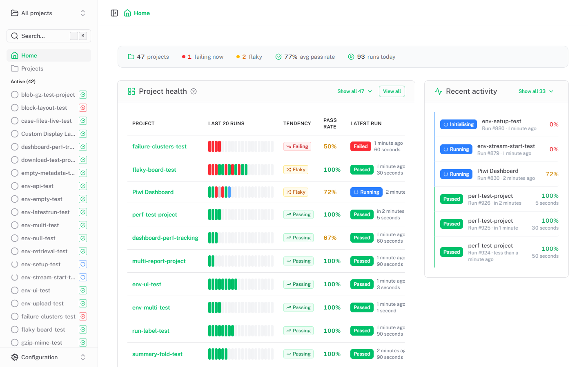

<p align="center">
  
</p>

<p align="center">
  <b>A permanent home for your Playwright test results.</b><br>
  CI reports vanish on every build. Piwi keeps them — and turns them into live dashboards,
  failure clusters, AI diagnosis, and cross-run analytics. Self-hosted, no SaaS.
</p>

<p align="center">
  <a href="https://piwitests.github.io/demo/"></a>
  <a href="https://piwitests.github.io"></a>
</p>

<p align="center">
  <a href="https://www.npmjs.com/package/@piwitests/reporter"></a>
  <a href="https://hub.docker.com/r/phenx/piwi-dashboard"></a>
</p>

<picture>
  <source media="(prefers-color-scheme: dark)" srcset="docs/public/screenshots/home-dark.png">
  <source media="(prefers-color-scheme: light)" srcset="docs/public/screenshots/home-light.png">
  
</picture>

## Why Piwi?

Native Playwright HTML reports are great for local debugging — but they're ephemeral. Once the next CI run completes, the old report is gone. Piwi keeps every run and makes them connected, searchable, and actionable:

- 🗄️ **Permanent history** — every run, trace, and report stored and browsable across time.
- ⚡ **Live streaming** — watch runs in real time as CI executes; no polling, no waiting.
- 🔗 **Failure clustering** — failures sharing a root cause are auto-grouped by error fingerprint.
- 🤖 **AI diagnosis** — LLM analysis of a failure cluster, grounded in your actual SCM diff.
- 📈 **Performance & flaky tracking** — P90 duration trends, slowest tests, composite flakiness scores.
- 🔌 **Built for automation** — drop-in reporter, REST API, OpenAPI docs, and an MCP server for AI agents.
- ☁️ **Zero lock-in** — self-hosted with Docker; your data in SQLite/PostgreSQL and local/S3 storage.

👉 **[Explore the live demo](https://piwitests.github.io/demo/)** — no install required.

## Quick start

**1. Start the dashboard**

```bash
# Linux / macOS
docker run -p 3000:3000 -v $(pwd)/.data:/app/.data phenx/piwi-dashboard:latest
```

```powershell
# Windows (PowerShell)
docker run -p 3000:3000 -v ${PWD}/.data:/app/.data phenx/piwi-dashboard:latest
```

Visit `http://localhost:3000`.

**2. Add the reporter to your test project**

```bash
npm install --save-dev @piwitests/reporter
```

```typescript
// playwright.config.ts
import { defineConfig } from '@playwright/test'

export default defineConfig({
  reporter: [
    ['list'],
    ['@piwitests/reporter', {
      serverUrl: 'http://localhost:3000',
      projectName: 'my-project',
    }],
  ],
  use: { trace: 'retain-on-failure' },
})
```

**3. Run your tests** — `npx playwright test`. Results appear automatically; the project is created on first submission.

➡️ Full setup, configuration, and CI integration in the **[Getting started guide](https://piwitests.github.io/getting-started)**.

## Documentation

| Topic | Link |
|-------|------|
| Getting started | [piwitests.github.io/getting-started](https://piwitests.github.io/getting-started) |
| Playwright reporter | [piwitests.github.io/reporter](https://piwitests.github.io/reporter) |
| UI overview | [piwitests.github.io/ui-overview](https://piwitests.github.io/ui-overview) |
| AI diagnosis & clustering | [piwitests.github.io/ai-diagnosis](https://piwitests.github.io/ai-diagnosis) |
| Flaky tests & analytics | [piwitests.github.io/flaky-tests](https://piwitests.github.io/flaky-tests) |
| Notifications & alerts | [piwitests.github.io/notifications](https://piwitests.github.io/notifications) |
| Configuration reference | [piwitests.github.io/configuration](https://piwitests.github.io/configuration) |
| API reference | [piwitests.github.io/api](https://piwitests.github.io/api) |
| MCP server | [piwitests.github.io/mcp](https://piwitests.github.io/mcp) |
| Authentication | [piwitests.github.io/authentication](https://piwitests.github.io/authentication) |
| Storage configuration | [piwitests.github.io/storage](https://piwitests.github.io/storage) |
| Deployment | [piwitests.github.io/deployment](https://piwitests.github.io/deployment) |

The running dashboard also serves interactive API docs (Scalar) at `/docs`.

## Contributing

```bash
cd application && npm install && npm run app:dev   # http://localhost:3000
```

See **[AGENTS.md](AGENTS.md)** for architecture, conventions, and the full development guide.

## License

MIT

---

<sub>**Disclaimer:** Piwi Dashboard is **not affiliated with, endorsed by, or connected to Microsoft Corporation** in any way. "Piwi" is a playful, unrelated name with no connection to any existing product or brand.</sub>
