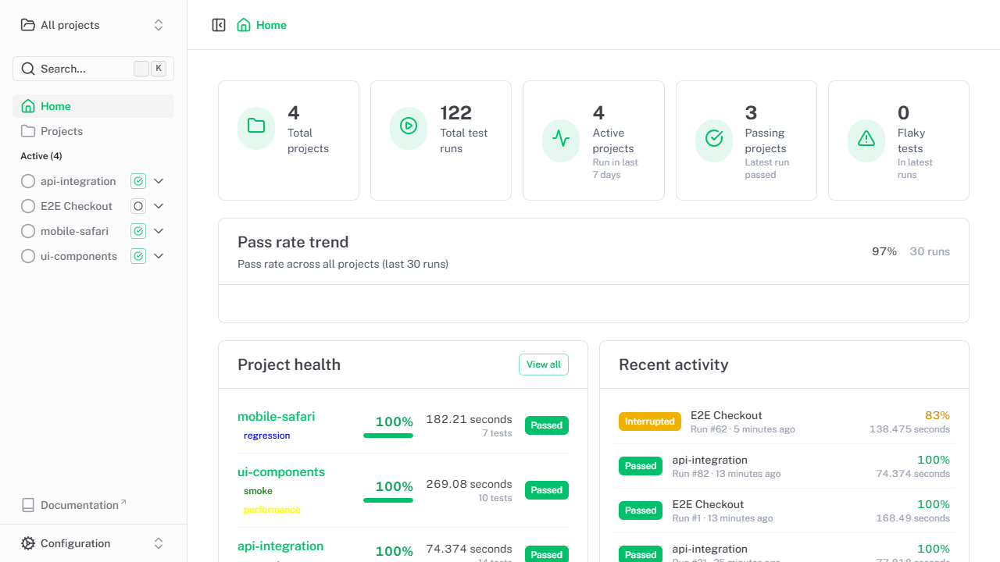
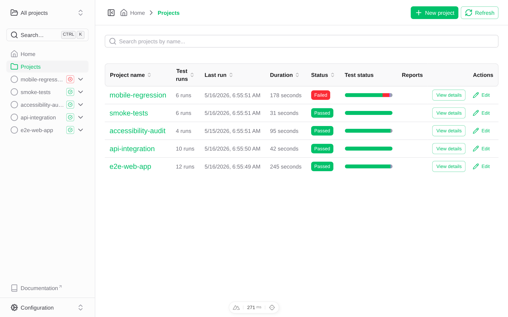
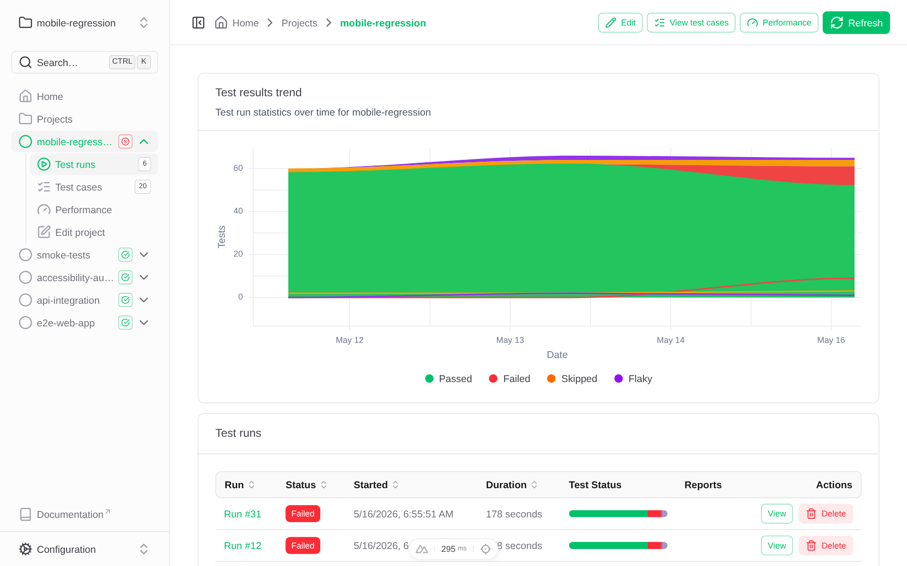
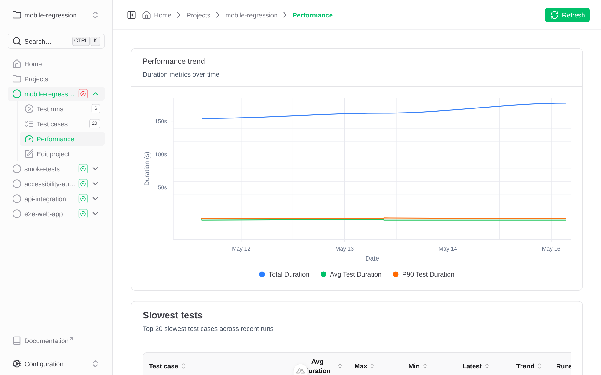
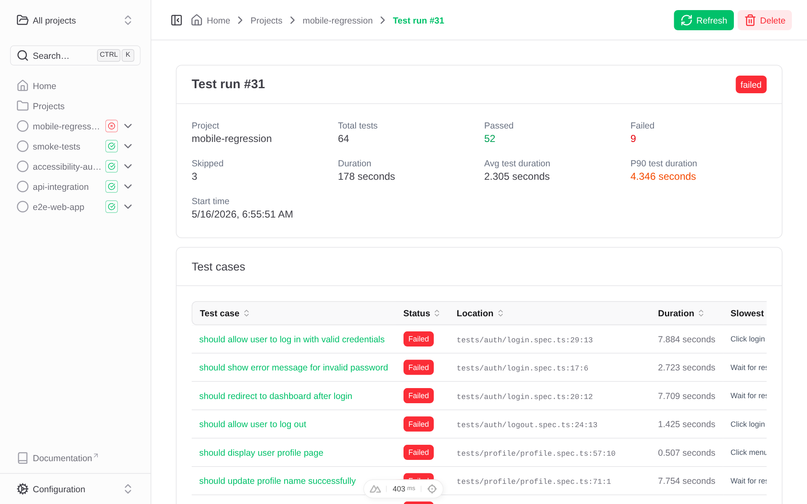

# Playwright Dashboard

[](https://ui.nuxt.com)
[](https://github.com/PhenX/playwright-dashboard/pkgs/container/playwright-dashboard)

**Playwright Dashboard** is a self-hosted web application for collecting, storing, and visualising [Playwright](https://playwright.dev) end-to-end test results over time. It gives your team a central place to monitor test health, investigate failures, track performance regressions, and share reports — without relying on external SaaS services.

📖 **[Full documentation](https://phenx.github.io/playwright-dashboard)** · 🎮 **[Live demo](https://phenx.github.io/playwright-dashboard/demo/)**



<details>
<summary>More screenshots</summary>

**Projects list** — all projects with last-run status and test ratio at a glance:



**Project detail** — full run history with pass/fail breakdown:



**Performance** — duration trend, slowest tests, and side-by-side run comparison:



**Test run detail** — every test case with status, duration, and error details:



</details>

## Why Playwright Dashboard?

Running Playwright tests in CI produces HTML reports that are ephemeral — once a new build runs, the old report is gone. Playwright Dashboard solves this by:

1. **Persisting every test run** — results, traces, and reports are stored permanently and browsable at any time.
2. **Showing trends** — spot flaky tests, performance regressions, and failure patterns across dozens or hundreds of runs.
3. **Streaming results live** — watch test progress in real time as CI executes, without waiting for the full run to finish.
4. **Zero vendor lock-in** — deploy on your own infrastructure with Docker; data stays in your SQLite/PostgreSQL database and local/S3 storage.

## Features

- 📊 **Test results storage** — store complete Playwright test run data (status, duration, retries, errors, flaky detection)
- 🎯 **Project organisation** — tests organised by project with tags, labels, and descriptions; auto-created on first submit
- 📈 **Performance tracking** — step-level timing, avg/P90 duration trends, slowest-tests analysis
- 🌐 **Network request analysis** — find slow API endpoints grouped by method + normalised route
- 🔬 **Browser Web Vitals** — TTFB, DOMContentLoaded, FCP and more via the Performance API
- 📊 **Run comparison** — side-by-side delta view with improved/regressed/unchanged summary
- 🔌 **Playwright reporter** — drop-in custom reporter for automatic result submission, with HTML report and trace uploads
- ⚡ **Real-time streaming** — live dashboard via Server-Sent Events; pages refresh instantly when a run starts or finishes, with no polling
- 🔐 **Authentication** — optional role-based access control (administrator, reporter, user) with API key support for CI
- ☁️ **Flexible storage** — SQLite or PostgreSQL database; local file system or S3-compatible object storage for artifacts
- 🐳 **Docker support** — pre-built multi-platform container images (~200 MB) on GitHub Container Registry

## Quick start

### 1. Start the dashboard

```bash
docker pull ghcr.io/phenx/playwright-dashboard:latest
docker run -p 3000:3000 -v $(pwd)/.data:/app/.data ghcr.io/phenx/playwright-dashboard:latest
```

Visit `http://localhost:3000`.

### 2. Install the reporter in your test project

```bash
npm install --save-dev @phenx/playwright-dashboard-reporter
```

### 3. Configure Playwright

```typescript
// playwright.config.ts
import { defineConfig } from '@playwright/test'

export default defineConfig({
  reporter: [
    ['list'],
    ['@phenx/playwright-dashboard-reporter', {
      serverUrl: 'http://localhost:3000',
      projectName: 'my-project',
    }],
  ],
  use: {
    trace: 'retain-on-failure',
  },
})
```

### 4. Run your tests

```bash
npx playwright test
```

Results appear automatically in the dashboard. The project is created on first submission.

## Dashboard UI overview

| Page | What it shows |
|------|---------------|
| **Home** | Aggregate stats (total projects, runs, passing rate, flaky count), test results trend chart, recent projects |
| **Projects** | Searchable/filterable table of all projects with last-run status, duration, test ratio, and report links |
| **Project detail** | Full run history for a single project with status badges and test breakdowns |
| **Performance** | Avg/P90 duration trend chart, top 20 slowest tests, side-by-side run comparison |
| **Test cases** | Per-project view of all unique test cases with pass/fail history |
| **Test run detail** | Every test case in a run with status, duration, location, error messages, traces, and reports |
| **Settings › Users** | User management and API key generation (when authentication is enabled) |
| **Settings › Storage** | Storage statistics and cleanup tools for old runs |
| **Settings › Tags** | Tag management for organising projects |

## Development

### Requirements

- **Node.js 24+** (uses native SQLite via `node:sqlite`)
- **npm**

### Running locally

```bash
cd application
npm install
npm run dev
```

### Available scripts

| Command | Description |
|---------|-------------|
| `npm run dev` | Start development server with hot reload |
| `npm run build` | Build for production |
| `npm run preview` | Preview production build locally |
| `npm run typecheck` | TypeScript type checking |
| `npm run lint` | Run ESLint |
| `npm test` | Run Playwright functional tests |
| `npm run db:generate` | Generate SQLite migration from schema changes |
| `npm run db:generate:pg` | Generate PostgreSQL migration from schema changes |
| `npm run db:studio` | Open Drizzle Studio (SQLite) |
| `npm run db:studio:pg` | Open Drizzle Studio (PostgreSQL) |
| `npm run seed:demo` | Regenerate demo seed data |

### Project structure

```
playwright-dashboard/
├── application/          # Nuxt 4 web application
│   ├── app/              # Frontend (Vue components, pages, composables)
│   ├── server/           # Backend (API routes, database, storage)
│   ├── public/           # Static assets
│   └── Dockerfile        # Production container image
├── reporter/             # @phenx/playwright-dashboard-reporter npm package
├── docs/                 # VitePress documentation site
├── DOCKER.md             # Docker deployment guide
└── README.md             # This file
```

## Documentation

| Topic | Link |
|-------|------|
| Getting started | [phenx.github.io/playwright-dashboard/getting-started](https://phenx.github.io/playwright-dashboard/getting-started) |
| Playwright reporter | [phenx.github.io/playwright-dashboard/reporter](https://phenx.github.io/playwright-dashboard/reporter) |
| API reference | [phenx.github.io/playwright-dashboard/api](https://phenx.github.io/playwright-dashboard/api) |
| Authentication | [phenx.github.io/playwright-dashboard/authentication](https://phenx.github.io/playwright-dashboard/authentication) |
| Storage configuration | [phenx.github.io/playwright-dashboard/storage](https://phenx.github.io/playwright-dashboard/storage) |
| Deployment | [phenx.github.io/playwright-dashboard/deployment](https://phenx.github.io/playwright-dashboard/deployment) |

## Contributing

See [.github/copilot-instructions.md](.github/copilot-instructions.md) for detailed development guidelines and architecture information.

## License

MIT
