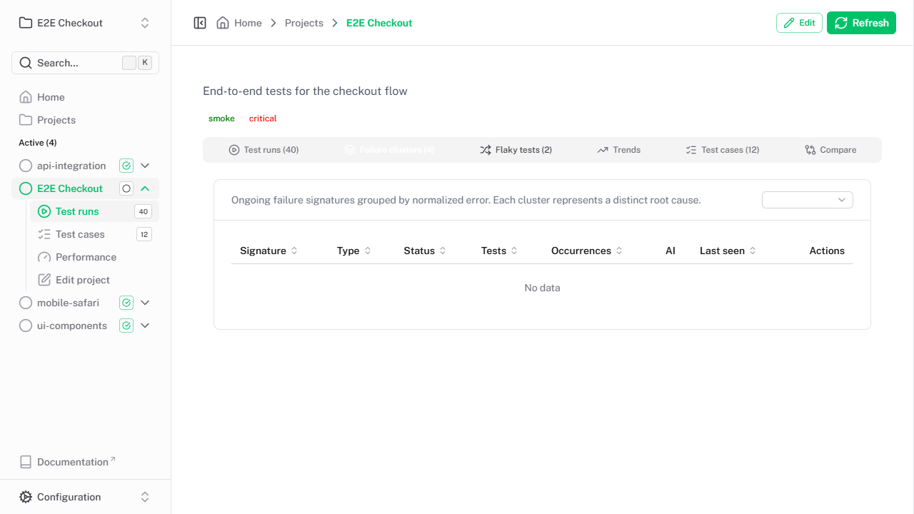
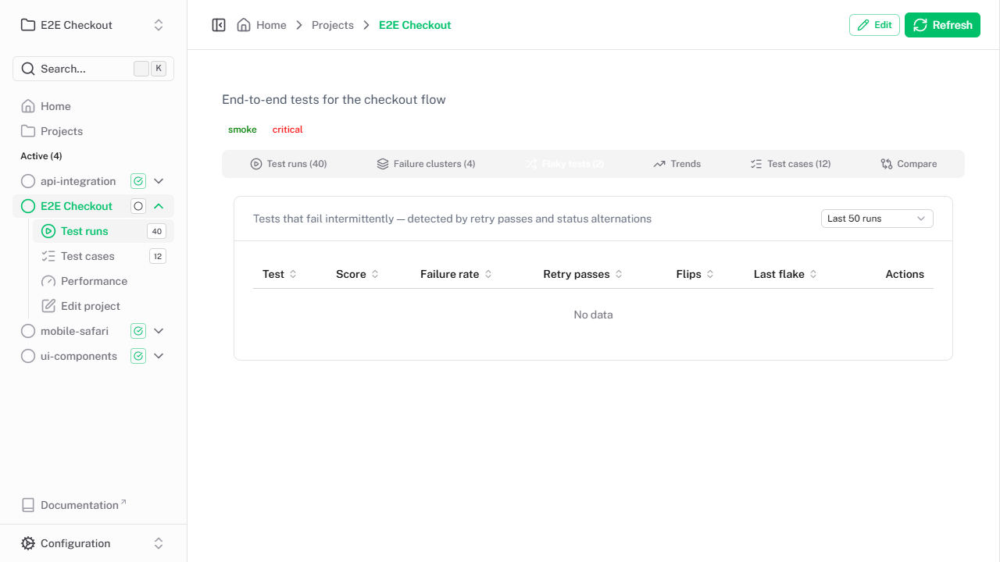
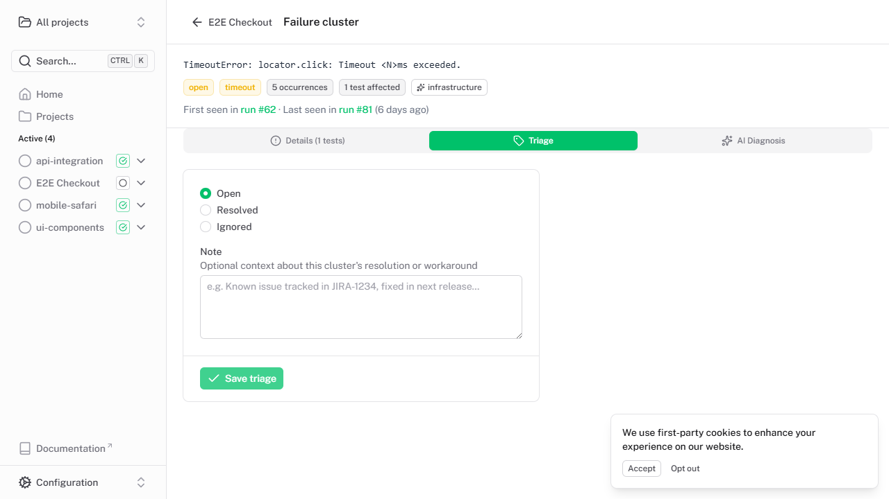

<p align="center">
  
</p>

> **Disclaimer:** Piwi Dashboard is **not affiliated with, endorsed by, or connected to Microsoft Corporation** in any way.  

[](https://ui.nuxt.com)
[](https://github.com/PhenX/piwi-dashboard/pkgs/container/piwi-dashboard)

**Piwi Dashboard** is a self-hosted web application for collecting, storing, and visualizing [Playwright](https://playwright.dev) end-to-end test results over time. It gives your team a central place to monitor test health, investigate failures, track performance regressions, and share reports — without relying on external SaaS services.

📖 **[Full documentation](https://phenx.github.io/piwi-dashboard)** · 🎮 **[Live demo](https://phenx.github.io/piwi-dashboard/demo/)**


<details>
<summary>More screenshots</summary>

**Projects list** — all projects with last-run status and test ratio at a glance:


**Project detail** — full run history with pass/fail breakdown:


**Performance** — duration trend, slowest tests, and side-by-side run comparison:


**Test run detail** — every test case with status, duration, and error details:


**Failure clusters** — error fingerprinting groups tests sharing the same root cause:



**Flaky tests** — composite flakiness score with retry-pass and alternation breakdown:



**Cluster triage** — set status, write triage notes, and track resolution:



</details>

## Why Piwi Dashboard?

Running Playwright tests in CI produces HTML reports that are ephemeral — once a new build runs, the old report is gone. Piwi Dashboard solves this by:

1. **Persisting every test run** — results, traces, and reports are stored permanently and browsable at any time.
2. **Showing trends** — spot flaky tests, performance regressions, and failure patterns across dozens or hundreds of runs.
3. **Streaming results live** — watch test progress in real time as CI executes, without waiting for the full run to finish.
4. **Zero vendor lock-in** — deploy on your own infrastructure with Docker; data stays in your SQLite/PostgreSQL database and local/S3 storage.

## Features

- 📊 **Test results storage** — store complete Playwright test run data (status, duration, retries, errors, flaky detection)
- 🎯 **Project organization** — tests organized by project with tags, labels, and descriptions; auto-created on first submit
- 🌍 **Environment tracking** — tag runs with a deployment environment (e.g. `production`, `staging`, `integration`) and filter by it in the run list
- 📈 **Performance tracking** — step-level timing, avg/P90 duration trends, slowest-tests analysis
- 🌐 **Network request analysis** — find slow API endpoints grouped by method + normalized route
- 🔬 **Browser Web Vitals** — TTFB, DOMContentLoaded, FCP and more via the Performance API
- 🌐 **Multi-browser support** — every test case records its browser config (project name, browser, channel, viewport); filter and sort by browser in the test run detail page
- 📊 **Run comparison** — side-by-side delta view with improved/regressed/unchanged summary
- 🔗 **Failure clustering** — failed tests sharing the same root cause are grouped automatically via error fingerprinting; run page shows failure groups with flaky and worker-correlation heuristics; each cluster has its own detail page with triage tools
- 🤖 **AI diagnosis** — one-click LLM analysis of any failure cluster (Anthropic, OpenAI-compatible, Ollama, etc.); diagnosis includes category, confidence, root cause, evidence, suggested fix, and prevention tips; auto-diagnose new clusters on run completion; supports global and per-project custom instructions to tailor analysis to your stack
- 🔀 **Flaky test detection** — composite flakiness score based on retry passes, status alternations, and failure rate; dedicated project tab with configurable lookback window
- 🔌 **Playwright reporter** — drop-in custom reporter for automatic result submission, with HTML report and trace uploads
- ⚡ **Real-time streaming** — live dashboard via Server-Sent Events; pages refresh instantly when a run starts or finishes, with no polling
- 🔐 **Authentication** — optional role-based access control (administrator, reporter, user) with API key support for CI and OAuth (Google, GitHub)
- ☁️ **Flexible storage** — SQLite or PostgreSQL database; local file system or S3-compatible object storage for artifacts
- 🐳 **Docker support** — pre-built multi-platform container images (~200 MB) on GitHub Container Registry

## Quick start

### 1. Start the dashboard

```bash
docker pull ghcr.io/phenx/piwi-dashboard:latest
docker run -p 3000:3000 -v $(pwd)/.data:/app/.data ghcr.io/phenx/piwi-dashboard:latest
```

Visit `http://localhost:3000`.

### 2. Install the reporter in your test project

```bash
npm install --save-dev @phenx/piwi-dashboard-reporter
```

### 3. Configure Playwright

```typescript
// playwright.config.ts
import { defineConfig } from '@playwright/test'

export default defineConfig({
  reporter: [
    ['list'],
    ['@phenx/piwi-dashboard-reporter', {
      serverUrl: 'http://localhost:3000',
      projectName: 'my-project',
    }],
  ],
  use: {
    trace: 'retain-on-failure',
  },
})
```

### 4. Run your tests

```bash
npx playwright test
```

Results appear automatically in the dashboard. The project is created on first submission.

## Dashboard UI overview

| Page | What it shows |
|------|---------------|
| **Home** | Aggregate stats (total projects, runs, passing rate, flaky count), test results trend chart, recent projects |
| **Projects** | Searchable/filterable table of all projects with last-run status, duration, test ratio, and report links |
| **Project detail** | Run history, failure clusters, flaky tests, trends, test cases, and run comparison — all in one tabbed view |
| **Performance** | Avg/P90 duration trend chart, top 20 slowest tests, side-by-side run comparison |
| **Test cases** | Per-project view of all unique test cases with pass rate, result breakdown, and link to each test's history |
| **Test run detail** | Every test case in a run with browser icon, status, duration, location, error messages, traces, and reports; filter by browser; failure groups with AI diagnosis |
| **Failure cluster** | Cluster detail with affected tests, triage tools (status + note), and LLM diagnosis (category, confidence, root cause, fix suggestion) |
| **Settings › AI** | Configure AI provider, auto-diagnose, and global analysis instructions |
| **Settings › Users** | User management and API key generation (when authentication is enabled) |
| **Settings › Storage** | Storage statistics and cleanup tools for old runs |
| **Settings › Tags** | Tag management for organizing projects |

## Development

### Requirements

- **Node.js 24+** (the version used by CI and the Docker image)
- **npm**

### Running locally

```bash
cd application
npm install
npm run dev
```

### Available scripts

| Command | Description |
|---------|-------------|
| `npm run dev` | Start development server with hot reload |
| `npm run build` | Build for production |
| `npm run preview` | Preview production build locally |
| `npm run typecheck` | TypeScript type checking |
| `npm run lint` | Run ESLint |
| `npm test` | Run Playwright functional tests |
| `npm run db:generate` | Generate SQLite migration from schema changes |
| `npm run db:generate:pg` | Generate PostgreSQL migration from schema changes |
| `npm run db:studio` | Open Drizzle Studio (SQLite) |
| `npm run db:studio:pg` | Open Drizzle Studio (PostgreSQL) |
| `npm run seed:demo` | Regenerate demo seed data |

### Project structure

```
piwi-dashboard/
├── application/          # Nuxt 4 web application
│   ├── app/              # Frontend (Vue components, pages, composables)
│   ├── server/           # Backend (API routes, database, storage)
│   ├── shared/           # Types & utilities shared between server and reporter
│   ├── public/           # Static assets
│   └── Dockerfile        # Production container image
├── reporter/             # @phenx/piwi-dashboard-reporter npm package
├── docs/                 # VitePress documentation site
├── DOCKER.md             # Docker deployment guide
└── README.md             # This file
```

### Reporter development

The reporter (`reporter/`) is written in TypeScript. Source files are in `src/`; compiled output goes to `dist/`.

```bash
cd reporter
npm install
npm run reporter:build         # compile TypeScript to dist/
npm run reporter:dev           # watch mode — auto-recompile on changes
```

The build produces `.js` + `.d.ts` files in `dist/`. The `package.json` `exports` field maps `@phenx/piwi-dashboard-reporter` and `@phenx/piwi-dashboard-reporter/fixtures` to their `dist/` counterparts.

Source layout (13 modules):

| Module               | Kind     | Purpose                                      |
|----------------------|----------|----------------------------------------------|
| `config.ts`          | Interface + function | `DashboardReporterOptions` + defaults merger |
| `reporter.ts`        | Class    | Main orchestrator (Playwright hooks, streaming, upload fallback) |
| `http-client.ts`     | Class    | HTTP/HTTPS transport (login, JSON, FormData) |
| `uploader.ts`        | Class    | Upload strategies (JSON, multipart, streaming files) |
| `stream-buffer.ts`   | Class    | Persistent JSONL event buffer                |
| `crash-recovery.ts`  | Class    | Recovery data save/load/retry                |
| `file-handler.ts`    | Class    | Report directory, trace/attachment file ops  |
| `metadata-collector.ts` | Class | CI, SCM, Playwright config metadata          |
| `step-analyzer.ts`   | Functions | Step categorization, flattening, performance |
| `helpers.ts`         | Functions | `getSetupFilePath`, `computeInstanceId`, `createGlobalSetup` |
| `compression.ts`     | Function  | Directory gzip archiver                      |
| `fixtures.ts`        | Fixtures  | Playwright network/web-vitals/console fixtures |
| `index.ts`           | Entry     | Re-exports class + `createGlobalSetup`       |

**Important:** Do not use `import type` from `../application/shared/` in reporter method signatures — it would leak the monorepo path into published `.d.ts` files. The shared types define the wire contract; the reporter stays loosely typed (`any`) since it handles Playwright internals.

## Documentation

| Topic | Link |
|-------|------|
| Getting started | [phenx.github.io/piwi-dashboard/getting-started](https://phenx.github.io/piwi-dashboard/getting-started) |
| Playwright reporter | [phenx.github.io/piwi-dashboard/reporter](https://phenx.github.io/piwi-dashboard/reporter) |
| API reference | [phenx.github.io/piwi-dashboard/api](https://phenx.github.io/piwi-dashboard/api) |
| Authentication | [phenx.github.io/piwi-dashboard/authentication](https://phenx.github.io/piwi-dashboard/authentication) |
| Storage configuration | [phenx.github.io/piwi-dashboard/storage](https://phenx.github.io/piwi-dashboard/storage) |
| Deployment | [phenx.github.io/piwi-dashboard/deployment](https://phenx.github.io/piwi-dashboard/deployment) |

## Contributing

See [AGENTS.md](AGENTS.md) for detailed development guidelines and architecture information.

## License

MIT
