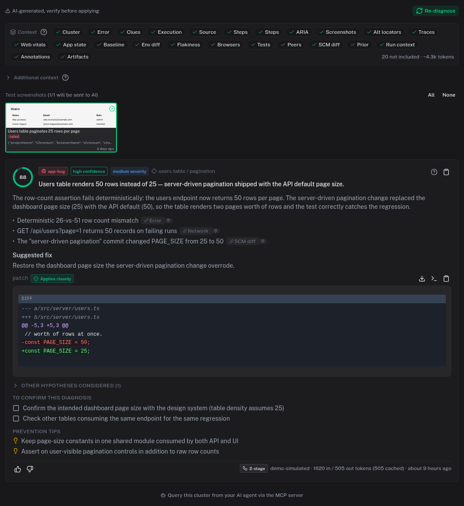
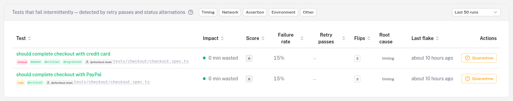
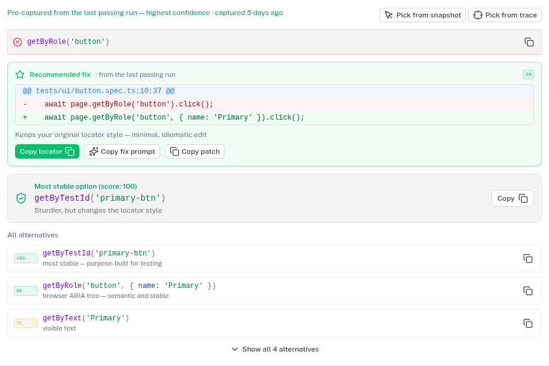
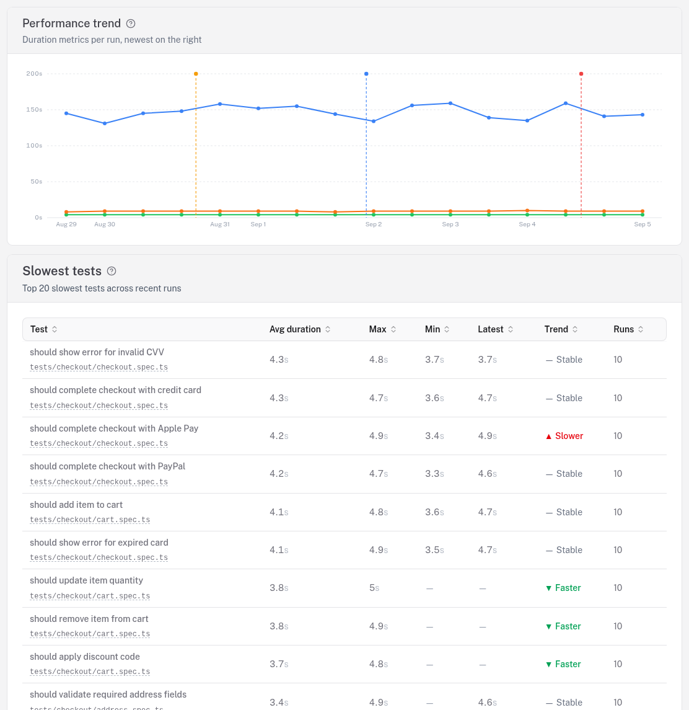

<p align="center">
  
</p>

<p align="center">
  <b>Your Playwright results, kept and explained.</b><br>
  CI throws away every report it makes. Piwi keeps them — every run, trace, and HTML report — then
  groups the failures by root cause, scores the flaky tests, and finds the locator you should have
  used. Self-hosted, MIT, zero telemetry.
</p>

<p align="center">
  <a href="https://piwitests.dev/demo/">Live demo</a> ·
  <a href="https://piwitests.dev">Documentation</a> ·
  <a href="./ROADMAP.md">Roadmap</a> ·
  <a href="https://github.com/PiwiTests/platform/discussions">Discussions</a>
</p>

<p align="center">
  <a href="https://www.npmjs.com/package/@piwitests/reporter"></a>
  <a href="https://www.npmjs.com/package/@piwitests/server"></a>
  <a href="https://hub.docker.com/r/phenx/piwitests-server"></a>
  <a href="https://github.com/PiwiTests/platform/actions/workflows/ci.yml"></a>
  <a href="./LICENSE"></a>
</p>

<p align="center">
  <a href="https://piwitests.dev/demo/">
    
  </a>
</p>

<p align="center">
  <sub>A run streaming in live. The <a href="https://piwitests.dev/demo/">demo</a> is the real app on seeded data — it runs entirely in your browser, no install and no backend.</sub>
</p>

## The problem it solves

Playwright's HTML report is excellent, and it lasts exactly until the next build. So the questions that
actually matter get hard to answer: *Has this test always been flaky? Did my fix work? Which of these
forty red tests are the same bug? What did we change the day the suite started failing?*

Piwi keeps the runs so you can answer them.

- **Permanent history** — every run, trace, and report, browsable long after CI deleted its artifacts.
- **Failures grouped by cause** — an error fingerprint collapses forty red tests into the three root
  causes behind them, each triaged once.
- **Flaky tests, scored and costed** — a composite score, a root-cause class, and the CI minutes each
  flake wastes, so you fix the expensive ones rather than the annoying ones.
- **Locator healing** — when a selector breaks, ranked replacements captured from the last passing run,
  with a recommended fix.
- **Evidence in one place** — the trace viewer, screenshots, console, network calls, Web Vitals, and the
  failing call stack with real source, all served by your own instance.
- **AI diagnosis, if you want it** — an LLM *you* configure explains a cluster against your actual git
  diff, and its suggested patch is checked against your source before you see it. Off by default.
- **Plain-English steps that stay deterministic** — `page.piwiLocator('the email field')` is resolved
  once by an agent into a committed artifact, then replayed as ordinary Playwright with zero model
  calls and no network. The LLM is a compiler, not a runtime.

Also in the box: cross-project analytics, live run streaming, notifications (email, Slack, webhook,
browser), a REST API with in-app OpenAPI docs, and an MCP server so your coding agent can ask about
test health.

## Pick a path

Five ways in, depending on what you already have:

| Path | Start here if | What it costs |
|---|---|---|
| **[Live demo](https://piwitests.dev/demo/)** | You just want to look around first | Nothing — seeded data, runs entirely in your browser |
| **[Desktop app](https://piwitests.dev/features/desktop)** | You run Playwright locally and don't want to run a server | Download an installer — no Docker, no Node |
| **Docker** *(below)* | You have Docker, or you're setting up a shared instance | One command |
| **`npx @piwitests/server`** | You have Node.js 22+ and would rather skip Docker | One command |
| **[One-click deploy](https://piwitests.dev/operate/deployment#one-click-deploy)** | You want a shared instance and no server to run it on | A button, plus whatever your host charges |

Two caveats worth knowing before you pick. The **desktop installers are not yet code-signed**, so the
first launch needs a click-through, and they exist for Windows x64 and Apple-silicon macOS only — on
Linux or an Intel Mac, use Docker or `npx`. The **one-click templates** ([`render.yaml`](./render.yaml),
[`fly.toml`](./fly.toml), [`deploy/`](./deploy), generated from the same variable registry as the
configuration reference so they can't drift from what the app reads) each provision one container with a
persistent volume and authentication on, but per-provider limits apply — Render needs a paid instance
for its disk, Koyeb attaches volumes after the fact. Both are covered in the
[deployment guide](https://piwitests.dev/operate/deployment#one-click-deploy).

## Quick start

Docker below; the desktop app replaces step 1 only, and everything after it is identical.

**1. Start the dashboard**

```bash
# Linux / macOS
mkdir -p .data && chown -R 1001:1001 .data # the container runs as non-root UID 1001
docker run -p 3000:3000 -v $(pwd)/.data:/app/.data phenx/piwitests-server:latest
```

```powershell
# Windows (PowerShell)
docker run -p 3000:3000 -v ${PWD}/.data:/app/.data phenx/piwitests-server:latest
```

Visit `http://localhost:3000`. A [`docker-compose.yml`](./docker-compose.yml) is included, and with
**Node.js 22+** you can skip Docker entirely — `npx @piwitests/server` creates its `.data/` in the
current directory.

> **Linux hosts:** the container runs as non-root UID 1001, so without the `chown` above, Docker
> auto-creates `.data` owned by `root` and the container can't write to it. Docker Desktop on Windows
> and macOS handles this for you. See
> [Permission issues with volumes](https://piwitests.dev/operate/deployment#permission-issues-with-volumes).

**2. Add the reporter to your test project**

```bash
npm install --save-dev @piwitests/reporter
```

```typescript
// playwright.config.ts
import { defineConfig } from '@playwright/test'

export default defineConfig({
  reporter: [
    ['list'],
    ['@piwitests/reporter', {
      serverUrl: 'http://localhost:3000',
      projectName: 'my-project',
    }],
  ],
  use: { trace: 'retain-on-failure', screenshot: 'only-on-failure' },
})
```

**3. Run your tests** — `npx playwright test`. Results appear as they finish; the project is created on
first submission.

**4. Add the capture fixtures** *(recommended)* — one file, and the deeper features light up: locator
healing, slow-endpoint analysis, Web Vitals, console capture, failure-time ARIA snapshots.

```typescript
// tests/fixtures.ts
import { test as base, expect } from '@playwright/test'
import { piwiFixtures } from '@piwitests/reporter'

export const test = base.extend(piwiFixtures)
export { expect }
```

Import `test` from this file in your specs instead of `@playwright/test` — that's the whole change.
Details in the [capture fixtures guide](https://piwitests.dev/guide/capture-fixtures); a runnable
project lives in [`examples/playwright-fixtures`](./examples/playwright-fixtures).

Steps 2–4 are also one command, if you prefer:
`npx @piwitests/reporter init --server-url http://localhost:3000 --project my-project` — idempotent,
and anything it won't rewrite is reported as a manual step with the exact change to make. See
[Getting started → Fast path](https://piwitests.dev/guide/getting-started#fast-path-one-command).

In CI, set `PIWI_DASHBOARD_URL` (and `PIWI_API_KEY` if auth is on) and you're done — branch, commit, CI
metadata and `--shard` merging are detected automatically. See
[CI & sharding](https://piwitests.dev/guide/ci).

It's one Node process: **~300 MB RAM idle** (1 GB comfortable), **1 vCPU**, `linux/amd64` or
`linux/arm64`. Disk is the variable — traces and reports dominate, so budget roughly 50–200 MB per run
and set a retention window. Your test project only needs a Node version Playwright supports; Node 22 is
the *dashboard's* requirement.

## Before you expose it

The command above gives you an **open dashboard with authentication off**, which is fine on localhost
and not fine on a network. Three things to set before anyone else can reach it:

- `PIWI_AUTH_ENABLED=true` and `PIWI_AUTH_SECRET` — turn on accounts and roles
  ([guide](https://piwitests.dev/operate/authentication)).
- `PIWI_SECRET_KEY` — without it, stored credentials (AI keys, SCM tokens) are encrypted with a
  built-in development key rather than yours.
- **HTTPS**, via a reverse proxy — see the
  [deployment guide](https://piwitests.dev/operate/deployment#reverse-proxy-https).

Generate a value for either secret with
`node -e "console.log(require('node:crypto').randomBytes(32).toString('hex'))"`.

The full list — including the trust-proxy flag, backups and version pinning — is the
[production checklist](https://piwitests.dev/operate/production-checklist).

Found a vulnerability? Please report it privately via the [security policy](./SECURITY.md).

## A quick tour

| | |
|---|---|
| [](https://piwitests.dev/features/ai-diagnosis) | [](https://piwitests.dev/features/ai-diagnosis) |
| **Failure clusters** — forty red tests, three root causes | **AI diagnosis** — read against your actual git diff |
| [](https://piwitests.dev/features/flaky-tests) | [](https://piwitests.dev/features/ui-overview) |
| **Flaky tests** — scored, classified, ranked by wasted CI time | **Run detail** — cases, worker timeline, traces, retry command |
| [](https://piwitests.dev/guide/reporter#locator-healing) | [](https://piwitests.dev/features/flaky-tests#performance) |
| **Locator healing** — replacements from the last passing run | **Performance** — P90 trends and slowest-test tracking |

## Where this fits

Playwright's own HTML report is the right tool for debugging a run on your machine; Piwi is for the runs
you can't open anymore. It's deliberately **Playwright-only** — that's what makes traces, step timing,
and locator healing first-class rather than lowest-common-denominator. If you need one place for JUnit,
pytest and Cypress results too, [ReportPortal](https://reportportal.io) or
[Allure](https://allurereport.org) fit that better. If you'd rather someone else ran the server,
[Currents](https://currents.dev) is the managed option. And if you only ever debug locally and never
look back, you don't need any of this.

The longer version, including where Piwi loses, is in
[Why Piwi?](https://piwitests.dev/guide/comparison).

## Published artifacts

Everything below is built and published from this repository on each release.

| Artifact | Registry | What it is |
|---|---|---|
| [`@piwitests/reporter`](https://www.npmjs.com/package/@piwitests/reporter) | npm | The Playwright reporter — add it to `playwright.config.ts` |
| [`@piwitests/server`](https://www.npmjs.com/package/@piwitests/server) | npm | The dashboard server, runnable with `npx @piwitests/server` |
| [`phenx/piwitests-server`](https://hub.docker.com/r/phenx/piwitests-server) | Docker Hub | The server container (`linux/amd64`, `linux/arm64`) |
| [`ghcr.io/piwitests/platform`](https://github.com/PiwiTests/platform/pkgs/container/platform) | GHCR | The same container, mirrored — plus an `edge` tag built from `main` |
| [`@piwitests/instrumentation-nitro`](https://www.npmjs.com/package/@piwitests/instrumentation-nitro) | npm | Optional: sends your Nitro/Nuxt backend's logs into a test run |
| [`PiwiTests.Instrumentation.AspNetCore`](https://www.nuget.org/packages/PiwiTests.Instrumentation.AspNetCore) | NuGet | Optional: the same for an ASP.NET Core backend |
| Desktop app (`.msi`, `.dmg`) | [GitHub Releases](https://github.com/PiwiTests/platform/releases/latest) | The server bundled in a native window — no Docker or Node |
| [Piwi Picker](https://chromewebstore.google.com/detail/piwi-picker/pakhnokpjboejcghgcmkjlpnogfjihhe) | Chrome Web Store | The browser extension — ranked Playwright locators picked from the live page (Chrome, Edge, and other Chromium browsers) |

The two instrumentation packages are optional and only needed for
[backend log capture](https://piwitests.dev/guide/backend-logs). Both container registries carry the
same images; use whichever your organization prefers. The extension is the one entry uploaded to its
store by hand rather than by CI, so its listed version can trail a release by a day or two.

## Project status

Pre-1.0 and under active development: expect occasional breaking changes between minor versions, pin a
version tag, and keep backups of `.data/`. Every commit runs a CI matrix across SQLite/PostgreSQL and
local/S3 storage with a full Playwright E2E suite.

Upgrades apply database migrations automatically on startup — and those migrations are **forward-only**,
so rolling back means restoring a backup, not pulling the old tag. Read
[Upgrading](https://piwitests.dev/operate/upgrading) before your first version bump. Direction and
non-goals live in the [roadmap](./ROADMAP.md).

## Documentation

Full docs at **[piwitests.dev](https://piwitests.dev)**. The usual entry points:

- [Getting started](https://piwitests.dev/guide/getting-started) — install, reporter, first run
- [Core concepts](https://piwitests.dev/guide/concepts) — runs, test cases, executions, clusters
- [Reporter](https://piwitests.dev/guide/reporter) and [CI & sharding](https://piwitests.dev/guide/ci) — getting results in
- [Deployment](https://piwitests.dev/operate/deployment) and [Configuration](https://piwitests.dev/reference/configuration) — running your instance
- [Upgrading](https://piwitests.dev/operate/upgrading) — what a version bump does, and why downgrading isn't a thing
- [Privacy & data flow](https://piwitests.dev/guide/privacy) — exactly what leaves your server (nothing you didn't configure)
- [Browser extension](https://piwitests.dev/features/extension) — pick ranked locators from the live page, standalone ([install from the Chrome Web Store](https://chromewebstore.google.com/detail/piwi-picker/pakhnokpjboejcghgcmkjlpnogfjihhe) — works in Edge too)

A running dashboard also serves interactive API docs at `/docs`, rendered in-app from its own OpenAPI
spec — no external CDN, so they work offline.

## Community & support

- 💬 [Discussions](https://github.com/PiwiTests/platform/discussions) — questions, ideas, show & tell
- 🐛 [Issues](https://github.com/PiwiTests/platform/issues) — bugs and feature requests
- 🔐 [Security policy](./SECURITY.md) — how to report a vulnerability

## Contributing

Contributions are welcome — [CONTRIBUTING.md](CONTRIBUTING.md) covers dev setup, tests, and commit
conventions; [AGENTS.md](AGENTS.md) has the architecture tour.

```bash
cd apps/application && npm install && npm run app:dev   # http://localhost:3000
```

## License

MIT

---

<sub>**Disclaimer:** Piwi Dashboard is **not affiliated with, endorsed by, or connected to Microsoft Corporation** in any way. "Piwi" is a playful, unrelated name with no connection to any existing product or brand. Playwright is a trademark of Microsoft Corporation.</sub>
