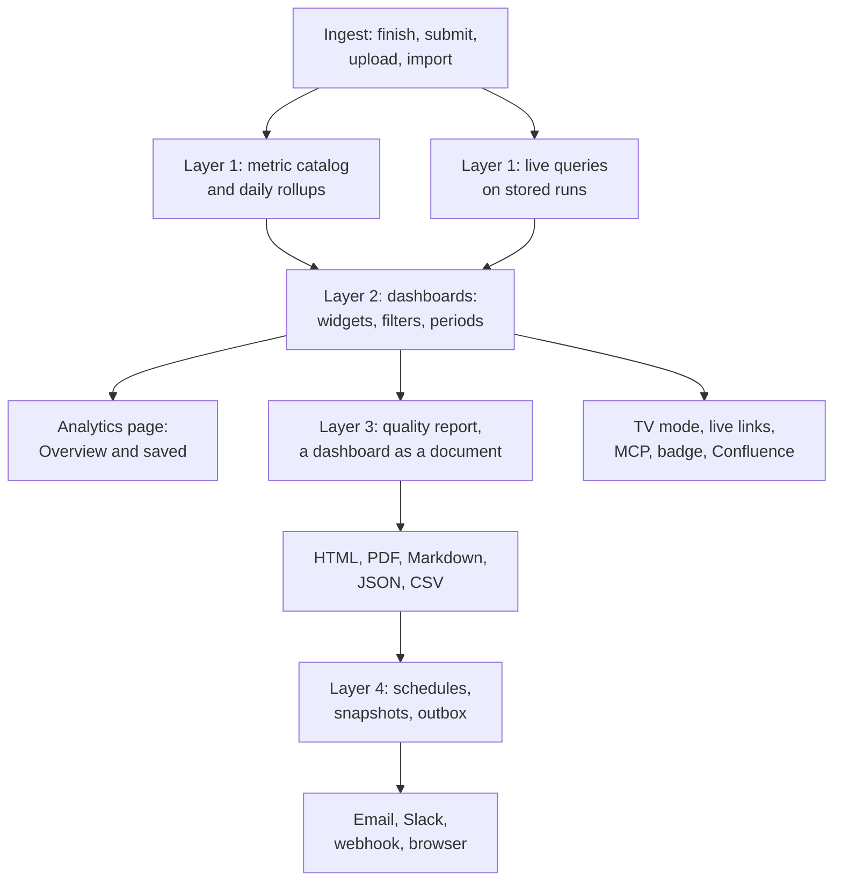

# Quality reports, dashboards and trends over time

A design record for two requests that keep coming back from users: **reports a stakeholder can read** (someone who
never opens the dashboard and does not read stack traces), and **trends and analytics over time** (does the suite get
better or worse, since when, and is what we do about it working), plus the one that follows from both: **custom
dashboards** with their own filters and periods. It argues that the three are one program with four layers, stages the
work so each stage pays for itself, and records the alternatives and open questions.

**Status.** Accepted and being built, milestone by milestone; nothing has shipped yet. Written 2026-09-22 against
0.36.0; refreshed 2026-09-24 against 0.37.0, which shipped the Test Map, the capability opt-out system and one status
color scale ([What 0.37.0 changed](#3-what-0370-changed-for-this-design)); extended the same day with custom
dashboards, filters and periods ([Layer 2](#layer-2-dashboards), [Filters and periods](#filters-and-periods)); decided
the same day: the four open questions on rollout order, dashboard sharing, test filters over time and live links took
their defaults (D30 to D33), the default dashboard is fixed ([The default dashboard:
Overview](#the-default-dashboard-overview), D34), and the daily rollups account for runs kept forever (D35). Each
milestone is built on a branch stacked on the previous one, in the order of the [Rollout sketch](#rollout-sketch). ·
**Date:** 2026-09-24 · **Builds on:** the `/analytics` page and its widget registry, test selections, the notification
outbox and digests, the offline export pipeline, share links, timeline markers, runs kept forever, the Confluence
section of [issue-tracker-integrations.md](issue-tracker-integrations.md), the Test Map's ledger and its unwired
weekly digest ([scenario-gaps.md](scenario-gaps.md)), and the capability registry
([capabilities-opt-out.md](capabilities-opt-out.md)).

**Summary.** Piwi computes good numbers and shows them to people who are logged in and looking. It has no way to
*send* a number to someone, no way to keep a number after retention deletes the runs behind it, no way for a team to
keep a view of its own, and no vocabulary a manager understands (money, days to fix, targets met). The proposal adds,
in order: (1) a **metric catalog** and **daily rollups**, one precomputed aggregate row per project and day that
survives retention and makes any window cheap, with **custom filters** (projects, project tags, environments,
branches, test selections, tags, owners, browsers) and **custom periods** (calendar periods, custom ranges, since a
marker, release cycles, sprints), all carried by the URL; (2) **dashboards**: the analytics page becomes the built-in
Overview dashboard, and anyone can save their own, widgets arranged in bands with default filters and periods, shared
without granting access, refreshed live, and shown in TV mode on a wall screen; (3) a **quality report**, any
dashboard rendered as a document through one `ReportBundle`, as an in-app page, HTML, PDF, Markdown, JSON and CSV,
with four built-in report dashboards (executive, engineering, team, gaps digest); (4) **report schedules**, saved
recurring deliveries by email, Slack and webhook through the outbox the notifications already use, with every
generated report kept as a **snapshot**. The same schedules carry the Test Map's weekly gaps digest, which shipped as
a selection function without a delivery task, and reports are one declinable capability. On top of that base the
analytics page gains per-project **targets**, markers on every trend, and widgets for suite growth, flaky debt, time
to fix, quarantine debt and ownership. The last milestone extends the reach: report and dashboard share links, a
status badge, publish-in-place to Confluence, a `piwi report` CLI command, MCP tools, a CSV and OpenMetrics export for
BI tools, and an optional AI-written narrative.

## Problem

### 1. Nothing Piwi produces is written for a stakeholder

Every surface that carries numbers is shaped for an engineer with a session:

- The **Analytics page** (`apps/application/app/pages/analytics.vue`) is ten widgets behind a login. It has no
  sentence, no verdict, no "compared with last month we are here", and it cannot be handed to anyone: no download, no
  link that works without an account, no schedule.
- The **notification digest** (`renderDigestEmail` in `apps/application/server/utils/email.ts`,
  `sendSlackDigest` in `server/utils/notifications/dispatch.ts`) is a list of event lines, "run #812 failed", "new
  cluster …". It says what happened, never how things stand.
- The **pull-request comment** (`apps/application/shared/pr-feedback.ts`) is a report, but of one run, for the
  author of one change.
- **Offline export** and **share links** (`apps/application/shared/export/`, `server/routes/share/[token].get.ts`)
  cover one execution or one failure cluster, with evidence. Right for an investigation, wrong for "how is the
  checkout suite doing".
- The **weekly gaps digest** of the Test Map is the newest example: `selectWeeklyDigest` and `renderDigest`
  (`shared/handlers/gap-digest.ts`) shipped in 0.37.0, and the docs mark delivery as planned, because Piwi has no
  time-triggered delivery to plug a selection into. Every "send this every week" feature meets the same wall.

Users answer the question by hand today: screenshots of widgets pasted into a slide or a Confluence page, numbers
retyped into a weekly mail. The [issue-tracker proposal](issue-tracker-integrations.md#confluence) already names the
missing object, "a per-project *Quality digest* page updated in place on a schedule", and defers it.

### 2. "Over time" stops where the raw data stops, and misses the questions people ask

The widgets compare the selected period with the previous period of the same length (`fetchScopedRuns(db, scope,
access, scope.days * 2)` in `shared/handlers/analytics/common.ts`), and bucket a series over the period
(`makeTimeBuckets`). That is a good start, and it has seven limits:

- **Retention erases the trend.** Every widget aggregates `test_runs` and `test_runs_cases` at request time. When
  `PIWI_RETENTION_DAYS` is set, the nightly sweep (`server/tasks/retention/sweep.ts`, `deleteRunsOlderThan`) deletes
  the runs, so "all time" shrinks to the retention window and a one-year pass-rate line is impossible on exactly the
  instances that run long enough to want one.
- **Some widgets scan every execution of the period.** Wasted time and regression velocity join `test_runs_cases`
  for the whole window (twice the window for the comparison). On a busy instance a 365-day period is a table scan per
  widget per page view.
- **The period is a preset.** Seven, thirty, ninety, 365 days or all time, always ending now
  (`ANALYTICS_PERIODS` in `shared/analytics/scope.ts`). "This sprint against the last one", "August", "between
  release 2.3 and 2.4", "since we migrated the runners" (a marker) cannot be asked.
- **Every reader gets the same page.** The analytics page has one layout, ten widgets in fixed bands, and one scope
  kept per browser in a cookie (`piwi-analytics-scope`). A team cannot keep a view of its own suites, a release
  manager cannot keep "main, production, since the last release", and a copied link does not show what its sender saw.
  Test-level filters (tags, owner, priority, feature, file path) exist on the flaky list, the test catalog and in test
  selections (`piwi run smoke`), never on a trend.
- **The questions stakeholders ask have no metric.** Nothing aggregates how long failures stay open (each cluster
  carries `timeToResolutionMs` and `fixLandedAt`, nothing sums them); nothing tracks how many tests the suite has
  over time, how many are flaky over time, how deep the quarantine debt is over time, or which team owns the pain
  (`test_cases.owner` and `failure_clusters.assignee` exist, no view groups by them). There is no notion of a target,
  so a number is never "met" or "missed". Wasted CI minutes are minutes, never money. The per-test stability trend
  exists only as an experimental endpoint for MCP (`server/api/test-cases/[id]/stability-trend.get.ts`) with no page.
- **Probe runs count as real runs in the widgets.** A probe run (the Test Map's `piwi probe`) replays a passing
  test with an injected fault, so it fails on purpose. It is stamped `metadata.piwiProbe`, and `isProbeRun()` keeps
  it out of spec health, flaky scoring, test history and the gaps ledger, but not out of `fetchScopedRuns`,
  `getProjectsOverview`, `getProjectPerformance`, `getProjectSlowTests` or `getRecentTestRuns`. The default *Full
  runs only* hides it (a probe run is a filtered run), so the numbers go wrong exactly when someone unticks it.
- **The default branch is not the default.** [first-class-branches.md](first-class-branches.md) shipped the branch
  filter and left open "scoping flakiness and trends to the default branch *by default*". Until then, a noisy feature
  branch moves every trend line.

### 3. What 0.37.0 changed for this design

Four things landed on 2026-09-23 that this record now builds on or must obey:

- **The Test Map shipped** (`scenario_gaps`, `probes`, `graph_nodes`, `graph_edges`; the Gaps tab, the feature map,
  change coverage on pull requests, detector precision, a gaps queue on Home). It brings the first metrics about the
  application rather than the suite, and its own rule for them: counts per class and per feature and the trend of gaps
  closed, never a coverage percentage. Its weekly digest is a pure selection with no delivery. This record adds the
  gaps metrics to the catalog behind the `test-map` capability, gives the engineering dashboard a scenario-gaps
  widget, and makes the report schedule the digest's delivery route.
- **The capability opt-out system is now the rule for optional features.** Every optional capability is one entry in
  `shared/capabilities.ts`, resolved once, hidden everywhere when declined, tagged on its MCP tools and listed in the
  product feature catalog. Quality reports register as the `quality-reports` capability; the analytics page stays
  core and is never gated.
- **One color per outcome and one pass-rate scale** became a MUST-follow rule (`app/utils/status-palette.ts`,
  `app/utils/pass-rate.ts`). A quality report is drawn outside the Vue app, so the report work moves the literal
  colors and the two thresholds into `shared/` where documents and emails can read them too.
- **One finalize helper per complete run.** `runFinalizeSideEffects` is what `finish`, `submit` and `upload` call, and
  it returns early for a probe run. The rollup hook goes there, and probe runs are excluded from every metric.

## What exists to build on

The point of the design is that almost every piece already has a home. New code is mostly one more entry in a
registry that exists.

| Need | Exists as | Where |
|---|---|---|
| A widget registry with one handler and one component per id | `ANALYTICS_WIDGETS`, `ANALYTICS_BANDS`, `runAnalyticsWidget` | `shared/analytics/registry.ts`, `shared/handlers/analytics/index.ts` |
| One filter object every aggregation receives, parsed identically on server and demo | `AnalyticsScope`, `parseAnalyticsScope` | `shared/analytics/scope.ts`, `server/api/analytics/[widget].get.ts`, `app/demo/api/router.ts` |
| The analytics scope kept per browser, and the shared filter bar | `useAnalyticsScope` (cookie `piwi-analytics-scope`), `FilterBar` (environments, branches, full runs), `AnalyticsScopeBar` (period and projects in the filter bar's leading slot) | `app/composables/useAnalyticsScope.ts`, `app/components/shared/FilterBar.vue`, `app/components/analytics/AnalyticsScopeBar.vue` |
| Period buckets and previous-period comparison | `makeTimeBuckets`, `periodStart`, `fetchScopedRuns` (fetches twice the period) | `shared/handlers/analytics/common.ts` |
| Deterministic "what changed" sentences over aggregates | `INSIGHT_RULES`, `evaluateInsightRules` (pure functions, unit-tested) | `shared/analytics/insight-rules.ts` |
| Per-execution signals already precomputed at ingest | `isNewRegression`, `isNewFlaky`, `wastedTimeMs`, `attempts` | `test_runs_cases` columns; `computeRegressionSignals()` fired by `runFinalizeSideEffects` (`server/utils/run-finalize-side-effects.ts`), the one finalize helper `finish`, `submit` and `upload` call, which skips probe runs |
| Per-cluster fix data | `createdAt`, `fixLandedAt`, `timeToResolutionMs`, `fixVerification`, `assignee` | `failure_clusters` |
| Per-project analyses | `getProjectsOverview` (tendency), `getProjectPerformance`, `getProjectSpecHealth`, `getProjectFlakyTests` (impact, wasted minutes), `getProjectSlowTests`, `getProjectTimeoutOpportunities`, `listQuarantine` | `shared/handlers/projects.ts`, `shared/handlers/quarantine.ts` |
| Per-test time series | `getTestCaseStabilityTrend` (bucketed by run count, MCP only) | `shared/handlers/test-cases.ts` |
| Named sets of tests, resolved per project | `test_selections` (predicate groups over tags, owner, priority, feature, file globs, quarantine and flakiness; built-ins `failed` and `quarantine-free`), `resolveSelectionDefinition`, selection health and drift | `shared/selection/types.ts`, `shared/handlers/selections.ts`, `shared/handlers/selection-analytics.ts` |
| Tag filters that work on both dialects | `jsonArrayContains`, `jsonArrayContainsAll`, `parseTagFilter` | `shared/utils/tag-filter.ts` |
| Counts from a run's executions, final attempt per test and browser | `distinctRunCountsFromAttempts` | `shared/utils/test-counts.ts`, `server/utils/run-counts.ts` |
| Dated events to explain a trend, and to anchor a period | `markers` table (categories `deploy`, `release`, `infra`, `incident`, …), auto markers on Playwright or reporter version change, `listProjectMarkers` | `schema.*.ts`, `shared/handlers/markers.ts`, `apps/docs/features/timeline-markers.md` |
| Destinations, schedules, retries | channels (email, Slack, webhook, browser), subscriptions with `mode: 'digest'` and `digestAt`, the outbox (`notification_deliveries`, `nextAttempt`, `sweepOutbox` every minute) | `server/utils/notifications/*`, `server/utils/outbox.ts`, `server/tasks/notifications/sweep.ts` |
| Email layout and Slack block rendering | `emailLayout`, `renderDigestEmail`, `sendSlackDigest`, HMAC-signed webhooks | `server/utils/email.ts`, `server/utils/notifications/dispatch.ts` |
| One data object rendered to five formats, with size budgets | `ExportBundle`, `collect*Bundle`, `buildExport`, `renderExportHtml` / `renderExportPdf` (pdf-lib, no browser) / `renderExportMarkdown`, `ExportBudget` | `shared/export/*`, `server/utils/export-request.ts`, `server/utils/export-assets.ts` |
| Read-only access without an account | `share_links` (hashed 256-bit token, expiry, revoke, view count), `GET /share/<token>` rendering the export HTML live | `server/utils/share-links.ts`, `server/routes/share/[token].get.ts` |
| A scheduler | Nitro `scheduledTasks` (cron strings): the three outbox sweepers every minute, `integrations:sync`, the nightly `retention:sweep` and `graph:sweep` | `nuxt.config.ts`, `server/tasks/` |
| Live run events | one shared SSE connection to `/api/stream`; `run-finished` published by `runEventBus.publishGlobal` | `app/composables/useRunStream.ts`, `server/api/stream.get.ts` |
| Startup backfill of a derived table, non-blocking and idempotent | `backfillTraceBlobResources`, `reclusterFailureFingerprints` | `server/database/index.ts` |
| Image processing on the server | `sharp` (already a dependency; reads SVG, writes PNG) | `server/utils/visual-diff.ts`, `server/utils/ai-images.ts` |
| Hand-drawn SVG charts | `barGeometry`, `niceTicks`, `dayTickIndices`, the series lists | `app/utils/chart.ts`, `app/components/analytics/*.vue` |
| One color per test outcome and one pass-rate scale (a MUST-follow rule since 0.37.0) | `STATUS_PALETTE`, `statusPalette()`, the `--color-status-*` tokens; `passRateTone`, `PASS_RATE_GOOD`, `PASS_RATE_FAIR`, `passRateStep` | `app/utils/status-palette.ts`, `app/utils/pass-rate.ts`, `app/assets/css/main.css` |
| Optional features a team can decline once, everywhere | `CAPABILITIES`, `resolveCapability`, `getInstanceCapabilities`, `useInstanceCapabilities().isHidden()`, MCP tools tagged `module` and `capability`, the Setup ladder's detection ids | `shared/capabilities.ts`, `shared/handlers/capabilities.ts`, `shared/handlers/setup-status.ts`, `app/composables/useInstanceCapabilities.ts` |
| The product feature catalog behind the generated feature map | `PIWI_FEATURE_GROUPS` (`docs:gen` renders it; `docs-drift.test.ts` resolves every `doc` anchor) | `shared/piwi-features.ts` |
| The Test Map: gaps, findings, probes, change coverage, precision | `scenario_gaps`, `probes`, `graph_nodes`, `graph_edges`; `listScenarioGaps`, `listAcceptedUnwritten`, `getFeatureMap` (open gaps by class per feature), `computeChangeCoverage`, `loadDetectorPrecision`, `isProbeRun` | `shared/handlers/scenario-gaps.ts`, `change-coverage.ts`, `detector-precision.ts`, `probes.ts`, `server/utils/feature-graph.ts` |
| A weekly digest selection with no delivery | `selectWeeklyDigest(gaps, since)` (the top five new gaps per project), `renderDigest` (Markdown) | `shared/handlers/gap-digest.ts` |
| Markdown rendered safely from untrusted text | `markdownToHtml`, raw HTML escaped, links flattened on demand | `shared/markdown-to-html.ts` |
| One schema library for server and client | `zod`, already a dependency | `shared/test-function-schemas.ts` |
| A small time-to-live cache | `TtlCache` | `server/utils/scm/cache.ts` |
| Instance locale and time zone | `resolveLocaleSettings`, `PIWI_LOCALE`, `PIWI_TIME_ZONE`, `formatAbsolute` | `server/utils/locale-settings.ts`, `shared/i18n/locale-format.ts` |
| Ticket language (English or French) | the comment-language resolution of the tracker integration (binding, then connection default, then English) | `server/utils/integrations/policies.ts` |
| Access control for anything cross-project | `getProjectScope`, `resolveAllowedProjects`, subscriptions re-check access at delivery | `server/utils/project-access.ts`, `shared/handlers/analytics/common.ts`, `server/utils/notifications/match.ts` |
| A CLI that talks to the dashboard with an API key | `piwi gate` (exit codes 0 / 1 / 2) | `packages/reporter/src/cli/gate.ts` |
| MCP tools over the same handlers | `get_performance_trend`, `get_test_stability_trend`, `get_instance_stats`, `list_flaky_tests` | `shared/mcp-tools.ts`, `server/utils/mcp/tools.ts` |
| The Confluence page that updates in place | designed, not built: "A living page" | [issue-tracker-integrations.md](issue-tracker-integrations.md#confluence) |

## Vocabulary

One name per concept, used everywhere below and in the code. The codebase already uses **run report** for the
Playwright HTML report a run carries (`RunReports.vue`), so the new document is never called just "report".

- **Quality report**: a document about the state of one or several projects over a period, written for a reader who
  may not use the dashboard. Rendered from a report bundle.
- **Report bundle** (`ReportBundle`): the data behind one quality report, the way `ExportBundle` is the data behind an
  offline export. Every output format renders the same bundle.
- **Widget**: the analytics page's existing term (`ANALYTICS_WIDGETS`) for one entry of the widget registry: a data
  handler, a page component and, with this record, a mapping to document blocks. A dashboard places widgets and a
  quality report renders them.
- **Band**: the analytics page's existing term (`ANALYTICS_BANDS`) for a titled group of widgets, such as "Where
  things stand".
- **Dashboard**: a named arrangement of widgets in bands, with a default scope. Built-in dashboards are defined in
  code and can only be duplicated; saved dashboards are private or shared. The analytics page becomes the built-in
  *Overview* dashboard, and four built-ins are meant for reports: *executive*, *engineering*, *team* and *gaps
  digest*.
- **Scope**: the analytics page's existing term (`AnalyticsScope`, the scope bar) for what a screen or a report shows:
  its filters, period, comparison and granularity. A dashboard stores a default scope and the URL carries the viewer's
  changes. A person's **project access** (`getProjectScope`), the projects they may open, is a different thing.
- **Run filter**: a filter that selects runs (projects, project tags, environments, branch policy, full runs),
  answered from the daily rollups.
- **Test filter**: a filter that selects tests (a selection, or tags, owner, priority, feature, file path) or
  executions (browsers), answered from the stored executions.
- **Selection**: the existing named, per-project set of tests that `piwi run <key>` executes (`test_selections`). A
  test filter can name one.
- **Period**: a stored period definition (rolling, calendar, custom range, since a marker, between markers, release
  cycle, sprint, all time), resolved each time it is used.
- **Period comparison**: the reference period a metric's change is measured against: the previous period of the same
  length (today's behavior), the previous calendar unit, release cycle or sprint, the same period a year earlier, or a
  period chosen by hand.
- **Report schedule**: a saved recurring delivery: a dashboard, a scope, a cadence, one or more channels.
- **Report snapshot**: one generated quality report, stored with its bundle, whether it was scheduled or generated by
  hand. Snapshots have a page, can be downloaded again and can be shared.
- **Metric**: a named, defined number (pass rate, wasted CI minutes, median time to fix). The **metric catalog** is
  the list of metric definitions the widgets, reports, MCP tools and exports all read.
- **Daily rollup**: the precomputed aggregates of one **cell**: a project, a UTC day, an environment, a branch and a
  run kind (full or partial). A cell has a **retained row**, recomputed from the runs still stored, and, once
  retention has deleted some of its runs, an **archived row** holding their numbers; reads sum the two (D35). Rollups
  are what long windows read, and what survives retention.
- **Target**: a per-project goal on a metric ("test pass rate on the default branch at least 98 %"). A report says
  whether a target is met.
- **Probe run**: a run the Test Map's `piwi probe` command produces by replaying a passing test with an injected
  fault, stamped `metadata.piwiProbe`. Never a real run: excluded from every metric in this record.

## Design in one page



Read it top down: every complete run feeds the metrics; dashboards arrange them into widgets with filters and periods;
the analytics page shows a dashboard, the quality report renders one, and schedules deliver it.

The four layers are independent deliverables. Layer 1 alone makes the analytics page correct over long windows, closes
the default-branch item and brings custom filters and periods. Layer 2 lets anyone keep a view, share it and put it on
a wall. Layer 3 renders a dashboard as a document; it needs the dashboard definition of Layer 2, not its editor. Layer
4 needs Layer 3. Everything under "trend depth" and "reach" is an addition to a layer, not a prerequisite of another.
The layers are the architecture; the rollout is the delivery order, in which the built-in dashboards arrive with the
quality report and saved dashboards after schedules.

## Layer 1: the metric catalog and daily rollups

### The metric catalog

Stakeholders argue about numbers, so every number gets one definition, in code, that every surface reads. The
catalog is a registry in `shared/analytics/metrics.ts`:

```ts
interface MetricDef {
  id: MetricId;                 // 'test-pass-rate', 'run-success-rate', 'wasted-ci-minutes', …
  label: string;                // sentence-case, as shown
  unit: 'percent' | 'count' | 'minutes' | 'ms' | 'days' | 'money';
  betterWhen: 'higher' | 'lower' | 'neutral';
  definition: string;           // one plain sentence, shown in help hints and report footers
  source: 'rollup' | 'live';    // rollup: any window; live: only inside the raw-data window
  grain: 'run' | 'test' | 'cluster' | 'gap';  // what one counted item is
  dimensions: DimensionId[];    // the breakdowns the metric widget may offer
  precision: number;
}
```

The first catalog. The definitions match what the widgets compute today where a widget exists; the differences are
named.

| Metric | Definition | Unit, direction | Source |
|---|---|---|---|
| Test pass rate | Passed tests divided by tests run, summed over the period's runs (what `getAnalyticsPortfolio` computes) | %, higher | rollup |
| Run success rate | Share of terminal runs whose status is `passed`. New: the release manager's number ("how often is main green") | %, higher | rollup |
| Runs | Terminal runs in the period | count, neutral | rollup |
| Suite size | Highest `totalTests` of a run in the period; growth is the change against the comparison period. New | count, neutral | rollup |
| Flaky occurrences | Sum of `flakyTests` over runs (what the portfolio's "flaky" column is) | count, lower | rollup |
| Flaky tests | Distinct tests that passed only on a retry at least once in the period | count, lower | live |
| Wasted CI minutes | Minutes inside wait steps plus minutes executing attempts that ended failed or timed out (`getAnalyticsWastedTime`) | minutes, lower | rollup |
| Wasted CI cost | Wasted CI minutes multiplied by the configured cost per minute. New, shown only when a cost is configured | money, lower | rollup |
| CI time | Sum of run durations (`getAnalyticsCiTimeTrend`) | minutes, lower | rollup |
| New regressions | Executions marked `isNewRegression` (`getAnalyticsRegressionVelocity`) | count, lower | rollup |
| Newly flaky | Executions marked `isNewFlaky` | count, lower | rollup |
| Open failure causes | Open, not snoozed failure clusters at the end of the period (`getAnalyticsPortfolio`'s `openClusters`) | count, lower | live (clusters survive run deletion) |
| Failure causes opened / fixed | Clusters created, and clusters whose fix landed, inside the period. New | count | live |
| Median time to fix | Median of `timeToResolutionMs` over clusters fixed in the period; p90 alongside. New | days, lower | live |
| Oldest open failure cause | Age of the oldest open cluster. New | days, lower | live |
| Fixes that held | Clusters fixed in the period and not regressed since, over clusters fixed. New | %, higher | live |
| Quarantine debt | Quarantined tests, tests ready to release, age of the oldest (`listQuarantine`). New as a trend | count, lower | live |
| Average run duration, average p90 test duration | Sums of `test_runs.duration` and `p90TestDuration` over the cell's runs, divided by the run count. A median is not summable across days, so a median run duration is live, inside the raw window only | ms, lower | rollup |
| Open scenario gaps, by class | Open `scenario_gaps` rows (`kind = gap`) per class: blind-spot, false-comfort, fragile. Only where the `test-map` capability is active. New | count, lower | live |
| Gaps closed | Gaps whose `closedAt` falls inside the period. The Test Map's rule applies: counts and the trend of gaps closed, never a coverage percentage. New | count, higher | live |
| Accepted but unwritten | Gaps accepted more than a week ago whose node still has no trusted test (`listAcceptedUnwritten`, the Home queue). New | count, lower | live |
| Open resilience findings | `kind = finding` rows in the unhandled and degraded classes, from server probes. New | count, lower | live |

`source: 'live'` metrics read the tables that already exist. Clusters and quarantine rows are not deleted by
retention, so their trends are complete regardless of the raw-data window; only test-identity metrics (flaky tests,
top lists) are bounded by it, and the report footer says so when a window exceeds it. Every live query filters probe
runs with `isProbeRun()`.

Two Test Map numbers stay out of the catalog for now: escaped defects (the detector shipped as a pure function; its
tracker loader has not) and the *protected* count the Test Map record defines but no handler exposes. Both join the
catalog the day the code exposes them; escaped defects in particular is the number a quality manager asks for first.

### Daily rollups

A new table in both `schema.sqlite.ts` and `schema.pg.ts`, migrations generated (`npm run db:generate` and
`db:generate:pg`, never hand-written):

`analytics_daily_rollups`

| Column | Notes |
|---|---|
| `id` | PK |
| `project_id` | FK → `projects`, cascade |
| `day` | `YYYY-MM-DD`, UTC, same key as `dayKey()` |
| `environment` | text, `''` when the run had none |
| `branch` | text, `''` when unknown |
| `full_run` | 0 / 1, the `is_full_run` dimension |
| `part` | `'retained'`: the runs still stored, recomputed from them; `'archived'`: the numbers of the runs retention deleted, written in the transaction that deletes them (D35) |
| `runs`, `passed_runs`, `failed_runs` | terminal runs; `failed_runs` counts `failed`, `timedout`, `interrupted` |
| `total_tests`, `passed_tests`, `failed_tests`, `skipped_tests`, `did_not_run_tests`, `flaky_tests` | sums over the cell's runs |
| `max_total_tests` | suite size proxy |
| `duration_ms`, `avg_test_duration_sum_ms`, `p90_test_duration_sum_ms` | sums; divide by `runs` for averages |
| `wait_ms`, `failed_exec_ms` | from `test_runs_cases` (`wastedTimeMs`, failed-attempt durations) |
| `new_regressions`, `new_flaky` | from `test_runs_cases` |
| `computed_at` | timestamp |

Unique index on `(project_id, day, environment, branch, full_run, part)`, plus an index on `(project_id, day)`. Every
filter the scope supports is a dimension, so any scope is a `SUM … GROUP BY day` over matching rows, with two
exceptions the read helper owns: `max_total_tests` is read with `MAX` (over both parts of a cell), and the `*_sum_ms`
columns are divided by the summed `runs` after aggregation, never per row. Rows are small: a project produces at most
two rows (retained and archived) per distinct (environment, branch, run kind) per day, bounded by its run count.

**Write path.** `upsertDailyRollup(db, runId)` in `shared/handlers/analytics/rollups.ts` recomputes the retained row
of the run's cell from the raw rows (`SELECT … FROM test_runs WHERE project_id = ? AND start_time BETWEEN day AND
day+1 AND environment = ? …`) and upserts it. Recomputing the cell instead of adding the run's numbers makes the call
idempotent by construction: a retry, a re-import or a double call cannot double-count. It is called from three places:
`runFinalizeSideEffects` (`server/utils/run-finalize-side-effects.ts`), the one helper `finish`, `submit` and `upload`
already route through, after its probe-run early return, so a probe run never reaches a rollup and a sharded run is
counted once, when the helper fires for the last shard; `shared/handlers/import-runs.ts`, because imports are silent
and bypass the helper; and the demo mirror `app/demo/api/reporter.ts`. The recompute itself drops `isProbeRun()` rows
from the raw set, so a cell is right even for a run that reached the table another way. The helper lives under
`shared/` and not `server/utils/` because the demo calls it too (the rule "never duplicate logic between server and
demo").

**Deletes.** Age-based deletion goes through `deleteRunsOlderThan`, from the nightly retention sweep and from the
*Cleanup old test runs* action in Settings → Storage (`server/api/admin/cleanup.delete.ts`). It calls
`deleteRunsByIds` with `{ archiveRollups: true }`: in the transaction that deletes the runs, their numbers are first
added to their cells' archived rows, then the retained rows are recomputed from the runs that stay. Deleting history
by age is archival, and that flag is what makes the rollup the memory of the instance: the raw rows go, the day's
numbers stay. Runs kept forever and the newest runs `PIWI_RETENTION_MIN_RUNS` protects stay in the retained row, so a
pruned day can hold both rows, and recomputing it stays exact (D35). Deleting one run by hand is a correction:
`deleteRunsByIds` recomputes the retained row of its cell, and the run's numbers leave the day. The archived row is
the only one ever incremented, and only inside the transaction that deletes its runs, so a retried sweep finds nothing
left to add.

**Reconcile and backfill.** The nightly `retention:sweep` gains a reconcile step that runs **before** pruning and
recomputes the retained rows of the last seven days, or fewer when `PIWI_RETENTION_DAYS` is shorter, so it catches a
write path that forgot the hook. It never touches an archived row. At startup, `initDatabase` kicks off a non-blocking
backfill on the pattern of `backfillTraceBlobResources`: every day with runs and no rollup row is computed in batches,
with an app setting (`analytics_rollups_backfilled_at`) recording completion so it runs once. Imported history (blob
reports, traces) is covered by the ingest hook and by the backfill alike. History that retention deleted before the
rollups existed cannot be recovered: the backfill computes what the stored runs, kept ones included, still hold, and
the widgets say where their data starts.

**Day boundary.** UTC, as `dayKey()` already is, so the heatmap and the rollups agree cell for cell. A run at 23:30
Paris time on the 3rd lands on the 3rd in UTC terms and on the 4th in the reader's calendar; the report labels every
bucket in the instance time zone (`resolveLocaleSettings`) and the metric catalog says "days are UTC". Changing the
boundary would mean recomputing every rollup, so it is an open question, not a default.

`makeTimeBuckets` today starts its buckets at "now minus N days", so one bucket straddles two calendar days. For the
heatmap and the rollups to agree cell for cell, buckets align to UTC midnight, the newest bucket being the current
day so far. The heatmap already describes a cell as a day, so this is the behavior its documentation promises.

### Filters and periods

`AnalyticsScope` (`shared/analytics/scope.ts`) grows into the full description of what a screen or a report shows:
which runs, which tests, which period, compared with what. Widgets, dashboards, reports and schedules all read it, and
the URL carries it.

**Run filters** are answered from the rollups, over any window:

- Projects, and **project tags**: the tags an administrator attaches to projects, a team tag for example ("every
  project tagged `payments`").
- Environments; branches, or the branch policy: `defaultBranchOnly: boolean`, **default `true`** on the analytics page
  and in reports, with an "All branches" toggle. A run counts when its `branch` equals the project's default branch
  (`readProjectDefaultBranch` in `shared/handlers/baseline-scope.ts`) **or is unknown** (`null`), so an instance whose
  reporter never learned the branch keeps working. Setting `branches` explicitly turns the default off. This closes
  the open Tier 2 item of [first-class-branches.md](first-class-branches.md).
- Full runs only.

**Test filters** are answered from the stored executions (D24) and use the selection syntax (D25):

- A **selection**, by key. `selection: 'smoke'` resolves, in each project of the scope, to that project's stored
  selection with that key (`resolveSelectionDefinition` over the catalog), so a convention such as `smoke` or
  `critical` works across projects; a project without the key is left out and named. The built-ins (`failed`,
  `quarantine-free`) work too.
- Or an **inline predicate group** in the selection syntax (`SelectionPredicateGroup` in `shared/selection/types.ts`):
  all of these tags, any of these tags, owner, priority, feature, file globs, text, quarantined. When one project is
  in scope, *Save as selection* turns it into a selection the CLI can run (`piwi run <key>`).
- **Browsers**: the Playwright project (`test_runs_cases.browserName`), a filter on executions.
- A test filter means the tests that match **today**, with their whole history, which is the selection resolver's own
  semantics (D32).
- With a test filter a widget counts from the matching executions, final attempt per test and browser
  (`distinctRunCountsFromAttempts`), not from the run counters: a pass rate "for `@critical`" is critical tests passed
  over critical tests run. Executions go back only as far as retention keeps them, and the widget says where its data
  starts.

**Periods** are stored as definitions (`PeriodSpec`) and resolved each time they are used (D23):

| Kind | Examples | Resolves to |
|---|---|---|
| Rolling | last 7, 14, 30 or 90 days; last 6 weeks; last 12 months | the span, ending now |
| Calendar | this week, month, quarter or year so far; last week, month, quarter or year | calendar boundaries in the instance time zone; a week starts on the locale's first day (`Intl.Locale` week info, Monday when unknown) |
| Custom range | 2026-08-01 to 2026-08-31 | the two dates, inclusive |
| Since a marker | since "Migrated CI to ARM runners" | the marker's `occurredAt`, to now |
| Between markers | from "Release 2.3" to "Release 2.4" | the two markers' times |
| Release cycle | this release cycle, the previous one | between consecutive `release` markers of one project |
| Sprint | this sprint, last sprint | a cadence (a length in days and a start date) stored with the scope |
| All time | everything kept | the existing ten-year window |

`resolvePeriod(spec, now, timeZone, markers)` in `shared/analytics/period.ts` is pure and unit-tested. Rollup-backed
series use whole UTC days (D4), so in a zone far from UTC a calendar period moves its edge hours to the neighboring
day; open question 2 records it.

**Comparison**: the previous period of the same length (the default), the previous calendar unit, release cycle or
sprint, the same period a year earlier, a custom range, or none. Every `*Delta` and `prev*` field in
`shared/analytics/types.ts` is computed against it.

**Granularity**: automatic (today's rule, about 31 buckets), day, week or month; buckets align to UTC midnight.

**The URL carries the scope** (D27). `parseAnalyticsScope` reads compact keys (`period=last-30d`,
`period=2026-08-01..2026-08-31`, `period=release-1`, `compare=year`, `by=week`, `sel=smoke`, `tags=critical`,
`browser=webkit`, …) and keeps accepting today's (`days`, `projects`, `environments`, `branches`, `fullRunsOnly`). The
cookie stays the per-browser default and the URL wins over it, so a copied link shows what its sender saw.
`encodePeriod` and `parsePeriod` round-trip every kind.

The scope bar gains the period, comparison and granularity pickers and a *Tests* filter (a selection or predicates,
and browsers), built on the shared `FilterBar`, so Home and the project pages can adopt the same test filter later.

### Which widgets move to the rollups

Scalar series and totals read the rollups: portfolio (pass rate, delta, run count, average duration), pass-rate
heatmap, CI time, wasted time (points, totals, per project), regression velocity. Identity-bearing widgets stay live:
flaky leaderboard, cluster landscape, browser matrix, slow endpoints, and the portfolio's `recentRuns` sparkline and
`latestRun`. The rule is one code path per number and per filter kind: with run filters only, a scalar series is
always read from the rollups, never "rollup for long windows, live for short ones"; with a test filter, always from
the executions. A unit test seeds runs, runs the hook, and asserts the rollup sums equal the live sums
(`analytics-handlers.test.ts` already has the seeding helpers).

The same milestone adds the `isProbeRun()` filter to `fetchScopedRuns`, `getProjectsOverview`, `getProjectPerformance`,
`getProjectSlowTests` and `getRecentTestRuns`, so the live widgets and the rollups agree on which runs exist. It is
one line per handler and ships first, on its own, as a fix.

## Layer 2: dashboards

The analytics page becomes the built-in *Overview* dashboard, and anyone can save their own: widgets arranged in
bands, with a default scope, each widget able to replace the period or narrow the filters. A quality report renders a
dashboard (Layer 3), so every saved dashboard can also be exported, scheduled and shared.

### What a dashboard is

```ts
interface DashboardDefinition {
  v: 1;
  scope: AnalyticsScope;                  // default filters, period, comparison, granularity (Layer 1)
  bands: Array<{
    title: string;
    description?: string;
    widgets: Array<{
      key: string;                        // stable inside the dashboard: URLs and edits address it
      type: AnalyticsWidgetId;            // an entry of the widget registry
      title?: string;                     // replaces the registry title
      size: 'full' | 'half';
      options?: Record<string, unknown>;  // checked against the widget's options schema
      scope?: Partial<AnalyticsScope>;    // may replace the period; may only narrow the filters
    }>;
  }>;
}
```

- Bands of widgets in order, each widget `full` or `half` wide: the structure of today's page (D21). Below `sm` every
  widget is full width, so a dashboard works at 375 px with no layout of its own.
- A widget may replace the period (a *Last 7 days* tile on a quarterly dashboard) and **narrow** the filters (only
  `@critical`, only WebKit), never widen them, so what a dashboard covers can be read off its scope bar.
- A definition carries its version `v`. The server checks it against each widget's `options` schema (zod, already a
  dependency) and fills in defaults; a widget a later release removed renders as "This widget is no longer available"
  instead of breaking the dashboard.
- Built-in dashboards are definitions in `shared/analytics/dashboards.ts`; saved ones are rows of
  `analytics_dashboards`:

| Column | Notes |
|---|---|
| `id` | PK |
| `name`, `description` | as shown in the switcher |
| `owner_id` | FK to `users`, ON DELETE SET NULL; null when authentication is off |
| `visibility` | `'private'` \| `'shared'` |
| `definition` | JSON `DashboardDefinition` |
| `created_at`, `updated_at`, `updated_by` | `updated_at` is the save precondition |
| `last_viewed_at` | throttled like `share_links.last_viewed_at`; feeds the *Unused* group |

A private dashboard whose owner is deleted goes with the orphan sweep (`sweepOrphans` in `server/utils/retention.ts`);
a shared one stays, editable by administrators.

### The widget registry grows

`AnalyticsWidgetMeta` (`shared/analytics/registry.ts`) keeps `id`, `title`, `icon`, `size` and `band`, and gains:

| Field | What it declares |
|---|---|
| `options` | a zod schema with defaults; the editor's form follows it |
| `requires` | `'single-project'` for the per-project analyses |
| `testFilters` | whether the widget honors a test filter; one that cannot says so in its subtitle |
| `document` | the mapping from its data to document blocks (Layer 3) |

New widgets join the ten: `metric` (below), `stats` (a row of metric tiles), `verdict` (the rule-based sentence),
`progress` (what is being done), `risks`, `list` (runs, failure clusters, flaky tests or scenario gaps matching the
scope, top N), `markers` (the events in the period), `text` (a note in Markdown, rendered through
`shared/markdown-to-html.ts`, which escapes raw HTML), and the single-project analyses that live on project pages
today (spec health, slow tests, performance trend, timeout opportunities, selection health). The Test Map widgets
follow the `test-map` capability per project.

### The configurable metric widget

One widget covers "this number, cut that way": a metric from the catalog, a display (`stat`, `line`, `bar`, `table`,
`heatmap`), an optional breakdown, the top N (5 to 25, the rest grouped as *Other*), and the comparison and the target
on or off. The catalog says which breakdowns a metric supports (its `dimensions`):

| Breakdown | Grain | Read from |
|---|---|---|
| Project, project tag, environment, branch, run kind | run | rollups |
| Browser, test tag, owner, priority, feature, spec directory | test | executions |
| Error type, cluster status, assignee | failure cluster | `failure_clusters` |
| Gap class, feature | scenario gap | `scenario_gaps`, with the `test-map` capability only |

"Wasted CI minutes by owner, weekly, this quarter", "pass rate by browser since the runner migration" and "flaky
occurrences by project tag" are each one widget. There is no query language (D28).

### Where dashboards live

- `/analytics` opens the viewer's default dashboard: the one they picked (a per-browser preference, like the analytics
  scope and the locale override today), else the instance default an administrator set, else the built-in Overview,
  which keeps everything today's page shows ([The default dashboard: Overview](#the-default-dashboard-overview)).
- A switcher in the page header lists built-in, shared and personal dashboards, with a search and an *Unused* group;
  `/analytics/d/<id>` opens one; `/analytics/dashboards` lists and manages them. No sidebar entry is added.
- Every dashboard header carries *Edit* (or *Duplicate* when you cannot edit it), *Copy link*, *Export* and *Schedule*
  (Layers 3 and 4, following the `quality-reports` capability) and *TV mode*.

### The default dashboard: Overview

Overview is what `/analytics` shows everyone who has not picked another default, so it is built from today's page:
the same four bands with their titles and descriptions, and the same ten widgets in the same order and widths.
Nothing a current user looks at moves or disappears. Its definition, in `shared/analytics/dashboards.ts`:

```ts
export const OVERVIEW_DASHBOARD: DashboardDefinition = {
  v: 1,
  scope: {
    period: { kind: 'rolling', days: 30 },  // today's default
    comparison: { kind: 'previous' },        // today's deltas, now also drawn on the trends
    granularity: 'auto',
    defaultBranchOnly: true,                 // new default (D5); "All branches" is one click away
    fullRunsOnly: true,                      // today's default
  },
  bands: [
    { title: 'Where things stand', description: 'The state of every project right now.', widgets: [
      { key: 'headline', type: 'stats', size: 'full', options: { metrics: [ // new
        'test-pass-rate', 'run-success-rate', 'flaky-tests', 'wasted-ci-minutes', 'open-failure-causes',
        'median-time-to-fix'] } },
      { key: 'portfolio', type: 'portfolio', size: 'full' },
      { key: 'insights', type: 'insights', size: 'half' },
      { key: 'heatmap', type: 'pass-rate-heatmap', size: 'half' },
    ] },
    { title: 'Where the pain is', description: 'What is costing you the most time and attention.', widgets: [
      { key: 'clusters', type: 'cluster-landscape', size: 'half' },
      { key: 'flaky', type: 'flaky-leaderboard', size: 'half' },
      { key: 'wasted', type: 'wasted-time', size: 'half' },
    ] },
    { title: 'Which way it is going', description: 'Movement over the selected period.', widgets: [
      { key: 'pass-rate-trend', type: 'metric', size: 'full', title: 'Pass rate over time', // new
        options: { metric: 'test-pass-rate', display: 'line' } },
      { key: 'regressions', type: 'regression-velocity', size: 'half' },
      { key: 'ci-time', type: 'ci-time-trend', size: 'half' },
    ] },
    { title: 'Detail', description: 'Breakdowns to reach for once you know what you are chasing.', widgets: [
      { key: 'browsers', type: 'browser-matrix', size: 'half' },
      { key: 'endpoints', type: 'slow-endpoints', size: 'full' },
    ] },
  ],
};
```

**What current users keep.**

- `/analytics` stays the address and opens Overview until the viewer or an administrator picks another default.
  Overview stays in the switcher and cannot be edited or deleted, only duplicated.
- The `piwi-analytics-scope` cookie is read as before: `days` becomes a rolling period of that many days (3650 stays
  *All time*), and projects, environments, branches and *Full runs only* carry over. A cookie that names branches
  keeps them, so the new branch default never overrides a choice someone made.
- Today's URL keys (`days`, `projects`, `environments`, `branches`, `fullRunsOnly`), `GET /api/analytics/[widget]` and
  the MCP tools that read analytics keep working (D27).
- The "No test runs in the last N days" alert and its *Show all time* action stay, for any period.
- Every band keeps its title and description, and every widget its card title.

**What gets better by default.** Each change shows on the page and can be undone from the scope bar.

- Only the default branch counts, with *All branches* one click away (D5): a broken feature branch no longer moves the
  trends.
- Probe runs are never counted (D20).
- A row of headline tiles opens the page: six numbers across every project in scope, each with its change against the
  previous period.
- *Which way it is going* opens with the pass rate over time, the previous period drawn as a faint line and markers on
  it: the cross-project trend the page does not have today.
- Markers appear on every trend, and the heatmap's cells become calendar days (UTC), as its description already says.
- When milestone 5 adds widgets, three join Overview where they answer its band's question: *Time to fix* beside
  *Wasted CI time*, *Suite growth* and *Flaky debt* in *Which way it is going*. The others (ownership, environment
  comparison, movers) go to the engineering dashboard and the widget picker.

Milestone 1 carries the cookie and the URL keys over, milestone 2 renders the page from this definition, and
milestone 4 adds the switcher and the choice of another default.

### Editing

- *New dashboard* starts empty or from any dashboard; a built-in can only be duplicated.
- Edit mode adds *Add widget* to each band (a slideover grouped by band, with a search) and a menu to each widget:
  *Configure* (title, options, period, filters), *Width*, *Move up*, *Move down*, *Move to band*, *Duplicate*,
  *Remove*. Moves are buttons, not drag and drop: they work at 375 px and from a keyboard, and need no new dependency.
- The editor previews from the unsaved definition through `POST /api/analytics/widgets/preview`; *Save* and *Save as*
  write it. A save carries the `updatedAt` it started from, so a concurrent save gets a 409 and the editor offers to
  reload or save a copy.

### Sharing and access

- A dashboard is private (its owner) or shared (listed for every signed-in user). Any signed-in user can keep private
  dashboards, as they keep their own notification subscriptions. Sharing needs the reporter or administrator role,
  checked in the handler the way `users/[id].patch.ts` checks self-or-administrator. A shared dashboard is edited by
  its owner or an administrator, and duplicated by everyone else. With authentication off every dashboard is shared,
  as every channel is global.
- **A dashboard grants no access** (D26). Each widget intersects the dashboard's projects with the viewer's project
  access (`resolveAllowedProjects`), and the header says "2 projects hidden (no access)" in meta text. A shared
  dashboard never shows a project to someone who cannot open it.

### Live data and TV mode

- An open dashboard refreshes the widgets whose projects a finished run touches, from the global SSE stream the app
  already holds open (`/api/stream`, the `run-finished` event), at most once per widget every 30 seconds. The demo
  uses its BroadcastChannel.
- *TV mode* (`?tv=1`) is for a wall screen: no navigation, larger type, its own refresh, and an optional rotation
  through several dashboards (`?cycle=12,15&every=60`). A screen with nobody signed in uses a live dashboard link (see
  Reach).

### Cost

A saved dashboard's widgets load through `GET /api/analytics/dashboards/[id]/widgets/[key]`, so the definition stays
on the server and the URL carries only the viewer's changes. Responses are cached for 60 seconds per dashboard
version, widget, resolved scope and viewer project access, in the `TtlCache` class of `server/utils/scm/cache.ts`
(moved to `server/utils/`), and a project's entries are dropped on its `run-finished` event.

### Agents

`list_dashboards` and `get_dashboard(id, scope?)` (`module: 'core'`) return each widget's payload, the JSON the page
renders, so "how did the checkout dashboard do this sprint" is one MCP call.

### Dashboards are core

The analytics page is core and is the Overview dashboard, so saved dashboards are not a declinable capability (D29):
an instance that never saves one sees today's page plus a switcher. *Export* and *Schedule* follow the
`quality-reports` capability.

## Layer 3: the quality report

### The bundle

`shared/reports/types.ts` mirrors `shared/export/types.ts`:

```ts
interface ReportBundle {
  generatedAt: string;
  piwiVersion: string | null;
  sourceUrl: string | null;           // back to /reports/:id or /analytics with the scope
  title: string;                       // "Checkout suite, week 38" or "All projects, August 2026"
  language: 'en' | 'fr';
  locale: string; timeZone: string;    // how dates and numbers were formatted
  scope: AnalyticsScope;               // resolved: projects listed by name, branch policy stated
  period: { from: string; to: string; label: string };
  comparison: { from: string; to: string; label: string } | null;
  dashboard: { ref: string; name: string };  // 'executive', 'engineering', … or a saved dashboard id
  verdict: { tone: 'good' | 'mixed' | 'bad'; sentence: string };
  widgets: ReportWidget[];             // in dashboard order, each { key, title, blocks[], notes[] }
  targets: TargetVerdict[];            // metric, target, actual, met
  definitions: MetricDef[];            // the catalog entries the report used, for the footer
  limits: string[];                    // "flaky-test lists cover the last 90 days (retention)"
}
```

Each widget maps its data to one or more blocks through its `document` function, and blocks are typed by `kind` so
every renderer knows how to draw them: `stats` (a row of metric tiles with deltas and target marks), `series` (one or
several time series with markers), `table` (rows with links), `list` (insight sentences), `text` (the narrative, a
note). Renderers draw blocks, never widgets, so a new widget is reportable without a renderer change. Every value that
comes from a test run (titles, error excerpts, branch names) is data and is escaped by the renderer, as the export
renderers do.

### Built-in report dashboards

A quality report renders a dashboard: any saved one, or one of the four built-in dashboards meant for reports, defined
in `shared/analytics/dashboards.ts` next to Overview. Their widgets are ordinary widgets, so each also works on a
page, and a team that wants a different report duplicates a built-in and edits it.

**Executive** (the stakeholder dashboard; no locators, no stack traces, plain words):

1. **Verdict** (`verdict`): one sentence. "The suite is healthier than last month: pass rate on `main` rose 2.1 points
   to 97.8 %, and three long-standing failure causes were fixed. Flaky retries still cost 11 hours of CI." Built by
   rules over the metrics, not by a model: the tone comes from targets and deltas, the sentence from templates per
   case.
2. **Where things stand** (`stats`): six tiles, each with its change against the comparison period and a target mark
   when one is set: test pass rate, run success rate, flaky tests, wasted CI time (and cost when configured), open
   failure causes with median time to fix, suite size.
3. **The trend** (`metric`): pass rate over the period with the comparison period as a faint line, markers drawn as
   vertical lines with their labels ("Playwright 1.63", "Migrated runners").
4. **What changed** (`insights`): three to six sentences from the insight rules (`evaluateInsightRules`), positive
   ones included, each with a link. The rules gain a target-aware entry ("pass rate is 1.2 points under the 98 %
   target").
5. **What is being done** (`progress`): clusters fixed and whether the fixes held, clusters assigned or with a ticket,
   tests released from quarantine, auto-heal pull requests opened. Stakeholders ask this second.
6. **Risks** (`risks`): targets missed or at risk, the oldest open failure causes with age and owner, quarantine debt.
7. **Footer**, added by the renderer to every quality report: scope, branch policy, period, definitions used, limits,
   the Piwi version, a link back.

**Engineering** (for the team that owns the suite): everything above, then the flaky leaderboard with owners and
wasted minutes, new and stale clusters with ticket keys, movers (newly flaky, fixed, slower by more than 25 %),
timeout opportunities, the browser matrix, slow shared endpoints, and, where the `test-map` capability is active for
the projects in scope, a **scenario gaps** widget: open gaps by class and by feature (from `getFeatureMap`), gaps
closed in the period, accepted-but-unwritten gaps, open resilience findings. It is the analytics page as a document,
in reading order.

**Team**: the engineering dashboard filtered by owner (`test_cases.owner`, `failure_clusters.assignee`), so a
schedule per team sends each team its own report. It needs no new widget, only the owner test filter,
the one the notification filters already have (`filters.owners`).

**Gaps digest**: the Test Map's weekly digest, delivered at last. One widget, the top five new gaps per project since
the previous delivery, straight from `selectWeeklyDigest`, then the counts per class and the gaps closed. The Test Map
record deferred "the digest delivery task"; a report schedule on this dashboard is that task, with the snapshot,
the channels and the retries it would otherwise have had to grow. Off by default, like every schedule, and gated by
the `test-map` capability.

### Renderers

One bundle, rendered by:

| Output | Renderer | Notes |
|---|---|---|
| In-app page `/reports/:id` and the preview | the widgets' own page components, laid out as a document | A parity unit test asserts the same facts appear in the Vue and HTML renderings, on the model of `export-parity.test.ts` |
| HTML (one file) | `shared/reports/render-html.ts`, the `html` tagged template from `shared/export/html.ts`, inline SVG charts, the export CSP | Also what the share route and the email body use |
| PDF | `shared/reports/render-pdf.ts` with pdf-lib; charts drawn as vector rectangles and lines (`drawRectangle`, `drawLine`), one section per page so pages drop into a slide deck | No browser, identical on server, desktop and demo, like the export PDF |
| Markdown | `shared/reports/render-markdown.ts`; tables, a text sparkline (`▁▂▃▅▇`) under each series | Pastes into Confluence, Jira, a pull request, Slack |
| JSON | the bundle itself | Agents, scripts, BI ingestion |
| CSV | `shared/reports/render-csv.ts`: one file per `series` or `table` section, or a ZIP of all | Cells starting with `=`, `+`, `-`, `@` are prefixed with `'` so a spreadsheet never executes a test title (CSV injection) |
| Email | `renderQualityReportEmail`: the HTML body with the trend as an inline PNG (`sharp` rasterizes the SVG, attached by content id). The PNG carries only the marks (bars, lines, gridlines); axis labels and the legend are HTML text beside it, because the production image (`node:*-alpine`) ships no fonts for the rasterizer | `SendEmailOptions` gains `attachments`; nodemailer supports `cid` |
| Slack | blocks: the verdict, the tiles as a two-column field list, the text sparkline, the changes as bullets, a button to the snapshot | Incoming webhooks cannot upload files; an image block needs a public URL, so a chart image is offered only when share links are enabled (the snapshot's share link serves `chart.png`) |
| Webhook | the bundle JSON, HMAC-signed like every webhook | Bridges to Teams, n8n, Zapier, a data warehouse |
| Browser | a notification "Your weekly quality report is ready" linking to the snapshot | Existing browser channel |

**Colors.** Since 0.37.0 every outcome has one color and every pass rate one scale (`STATUS_PALETTE` and
`PASS_RATE_GOOD` / `PASS_RATE_FAIR` in `app/utils/`, the `--color-status-*` tokens in `app/assets/css/main.css`), and
the rule forbids a threshold or a color at a call site. The renderers here run in `shared/` (server, demo, browser)
and cannot import `app/utils/*`; the export renderers and `email.ts` still carry their own literals (`--pass` and
`--fail`, `COLORS`, `PASSED_COLOR` and `FAILED_COLOR`). The report work moves the literal values and the two
thresholds into `shared/status-colors.ts`: one hex per outcome, the two pass-rate thresholds, the five heatmap steps.
`status-palette.ts` and `pass-rate.ts` keep the Tailwind utilities and read the literals from it; the export
renderers, `email.ts` and the report renderers read it too; a unit test pins the `main.css` tokens to the shared
literals, so a document, an email and the dashboard cannot paint one outcome three ways.

### Money

`Settings → Performance` gains **Cost of a CI minute** (amount and currency), stored as the `ci_cost` app setting with
the env override `PIWI_CI_MINUTE_COST` (`"0.008 USD"`, registered in `shared/piwi-env-vars.ts` with `since`). When
set, every wasted-time number is followed by its cost, in the report and in the wasted-time widget. Unset, nothing
changes. This is the single most requested translation for a non-engineering reader and costs one setting.

### Language and locale

Dates, numbers and durations format through `formatAbsolute` and the instance locale and time zone, as the app
already does. The narrative is generated from sentence templates keyed by language; English and French ship, on the
model of the tracker integration's comment language (`server/utils/integrations/policies.ts` resolves it from the
project binding, then the connection default, then English); that resolution is reused as the report language
default, per project when bound, else the instance default. No other translation layer is introduced.

### Entry points

- Every dashboard, Overview included, gets **Export**: a preview of the dashboard as a document, with *Download*
  (HTML, PDF, Markdown, JSON, CSV), *Share* (when share links are enabled) and the four built-in report dashboards one
  click away over the same scope. It also gets **Schedule…**, which creates a schedule pre-filled with the dashboard
  and its current scope.
- The **project page** gets the same two actions, scoped to the project.
- A **`/reports` page**, under Analytics in the sidebar: the snapshots (newest first, with dashboard, scope, period,
  how it was delivered) and the schedules. `/reports/:id` shows one snapshot.

### Capability and feature catalog

Quality reports are optional, so they follow the opt-out system rather than adding a flag:

- One entry in `CAPABILITIES` (`shared/capabilities.ts`): `id: 'quality-reports'`, `module: 'workflow'`,
  `levels: ['instance']`, `needs: []`, `detection: 'quality-reports'`, `since` the release that ships it,
  `doc: 'features/quality-reports'`. Not `passiveData`: a schedule or a snapshot exists because someone made it, so
  the "data always wins" rule applies, as it does for notifications.
- The detection id joins `SetupCapabilityId` and `SETUP_LADDER_ORDER` (`shared/handlers/setup-status.ts`): evidence
  is one `report_schedules` or `report_snapshots` row. The Setup ladder then shows the entry with a *New* marker on
  instances older than the release, with no extra code.
- The `/reports` sidebar entry, the *Export* and *Schedule* actions and the snapshot cards read the resolved state
  through `useInstanceCapabilities().isHidden('quality-reports')`, as the Home gaps queue reads `test-map`. Declined
  means none of them render and the MCP tools drop out of the list; the REST endpoints stay callable, as the
  scenario-gap endpoints do, because a decline is a display decision, not an access rule.
- MCP report tools carry `module: 'workflow'` and `capability: 'quality-reports'`, so the route drops them when the
  capability is declined; the metric trend tools carry `module: 'core'` and no capability, because analytics is core
  and never gated.
- Two entries in `PIWI_FEATURE_GROUPS` (`shared/piwi-features.ts`), "Quality reports" and "Trends over time", under
  the job they serve, with `doc` anchors that exist before the entry does (`docs-drift.test.ts` resolves them);
  `npm run docs:gen` regenerates the feature map.
- The scenario-gaps widget follows the `test-map` state of each project in scope, per project, so a
  report over five projects of which one declined the Test Map has gaps for four.

## Layer 4: schedules and delivery

### Tables

`report_schedules`

| Column | Notes |
|---|---|
| `id` | PK |
| `name` | as shown in the list |
| `user_id` | FK → `users`, nullable; null = global (administrator-managed), same convention as channels and subscriptions |
| `scope` | JSON `AnalyticsScope` changes applied over the dashboard's scope (projects, environments, branch policy, test filters, owners); the period comes from the cadence |
| `dashboard_id` | FK to `analytics_dashboards`, ON DELETE SET NULL: the saved dashboard to render; added by milestone 4, which creates that table (D30) |
| `builtin_dashboard` | `'executive'` \| `'engineering'` \| `'team'` \| `'gaps-digest'` \| `'overview'` \| null: set when `dashboard_id` is not |
| `cadence` | `'daily'` \| `'weekly'` \| `'biweekly'` \| `'monthly'` |
| `anchor` | weekday (weekly, biweekly) or day of month (monthly) |
| `at` | `HH:mm` **in the instance time zone** (`resolveLocaleSettings`; when that setting is `auto`, meaning the viewer's browser zone, schedules use UTC and the form says so; `digestAt` is UTC and stays so) |
| `comparison` | `'previous'` \| `'year-ago'` \| `'none'` |
| `include_share_link` | boolean; mint a read-only link per snapshot, only when share links are enabled |
| `language` | `'en'` \| `'fr'` \| null (project or instance default) |
| `channel_ids` | JSON number[] of `notification_channels` |
| `active`, `muted_until`, `last_run_at`, `next_run_at`, `created_at`, `updated_at` | |

`report_snapshots`

| Column | Notes |
|---|---|
| `id` | PK |
| `schedule_id` | FK → `report_schedules`, ON DELETE SET NULL; null when generated by hand |
| `created_by` | FK → `users`, SET NULL |
| `dashboard_ref`, `dashboard_name`, `scope`, `period_from`, `period_to`, `comparison_from`, `comparison_to` | what was asked |
| `bundle` | JSON `ReportBundle`; the frozen numbers, so the report someone received in March reads the same in June, whatever retention did since |
| `size_bytes`, `generated_at` | |

Snapshots are pruned by the retention sweep after `PIWI_RETENTION_REPORT_DAYS` (default 365; 0 keeps them). A bundle
is a few tens of kilobytes of JSON; it carries no evidence bytes.

### The task and the outbox

A `reports:schedule` task runs every five minutes from `scheduledTasks`. For every active schedule with `next_run_at
<= now`: compute the period (since the previous scheduled instant, so a biweekly schedule reports on a sprint),
resolve the scope against the owner's project access at that moment (`getProjectScope`, as `match.ts` does for
subscriptions; a global schedule sees every project), render the schedule's dashboard into a bundle, store the
snapshot, then insert one `notification_deliveries` row per channel with `event: 'report.ready'` and a payload `{
snapshotId, scheduleId, periodEnd }`, `dedupe_key = report:<scheduleId>:<periodEnd>:<channelId>`. Then advance
`next_run_at`. The existing minute sweeper (`sweepOutbox`) dispatches the rows with its retries and backoff;
`dispatch.ts` gains one branch per channel type for `report.ready` that loads the snapshot and calls the renderer for
that channel.

Consequences of reusing the outbox rather than sending from the task: a restart between "snapshot stored" and
"delivered" resends nothing twice (the unique dedupe key), a Slack outage is retried on the same backoff table as
every other delivery, `sweepOutbox` already left-joins `subscriptions` so a row without one is picked up, and the
`notification_deliveries` retention already applies. `report.ready` is a separate constant, deliberately **not** a
member of `NOTIFICATION_EVENTS`: `SubscribeBell.vue` and the subscription form list that array, and a report is not
something to subscribe to. Only the task writes the event, and `dispatch.ts` branches on it before
`renderEventSubject`.

A schedule whose period contains no run still sends: "No runs were recorded for this scope this week" is information a
stakeholder wants (the pipeline is off). A schedule can be muted like a subscription. From milestone 4, a schedule
whose saved dashboard is deleted is deactivated: deleting a dashboard that schedules use asks first and names them,
and the Reports page shows each one as inactive, with the reason, until its owner points it at another dashboard.

### Who may do what

Creating, editing and deleting schedules requires the reporter or administrator role; a global schedule requires an
administrator, and a global schedule must target global channels, as global subscriptions must. Any project member
can open the snapshots of the projects they can see: a snapshot is readable when the reader can access every project
in its scope (the same rule as an analytics widget, applied to the stored scope). Generation always intersects the
scope with the schedule owner's access at run time, so a user removed from a project stops receiving its numbers on
the next run.

## Trend depth: what "over time" gains on the analytics page

Each item is a widget or a widget option; none needs new tables beyond the rollups.

| Addition | Reads | Why a stakeholder or a lead asks for it |
|---|---|---|
| **Custom periods and filters** on every dashboard, the analytics page included (see *Filters and periods*) | Layer 1 | "August against July", "the smoke tests since the runner migration", "this sprint against the last one" |
| **Default branch by default** with an "All branches" toggle | `defaultBranchOnly` | Trends stop moving when someone pushes a broken branch |
| **Markers on every analytics trend** (today only on project charts) | `markers`, scoped to the selected projects and environments; with one project in scope every marker is drawn, across projects only `release`, `infra` and `incident` markers, labeled with their project, so ten projects' deploys do not paint the chart over | "The drop started the day of the runner migration", on the cross-project view |
| **Suite growth** widget: suite size, skipped share, did-not-run share over time | rollups (`max_total_tests`, `skipped_tests`, `did_not_run_tests`) | "Are we adding tests, and are they running" |
| **Flaky debt** widget: flaky occurrences per run over time, distinct flaky tests inside the raw window, quarantine debt line | rollups + `quarantined_tests` | "Is flakiness going down since we started fixing it" |
| **Time to fix** widget: clusters opened and fixed per bucket, median and p90 time to fix, fixes that held, age distribution of open clusters | `failure_clusters` | "How fast do we react", the operational metric |
| **Ownership scorecard**: one row per owner (from `test_cases.owner`, `failure_clusters.assignee`): open clusters, flaky tests, wasted minutes, median time to fix, with an "Unowned" row | live | "Which team", and the built-in *Team* dashboard |
| **Environment comparison**: pass rate and run success per environment over time, side by side | rollups (`environment` dimension) | "Staging is green and production is not" |
| **Movers** widget: tests that became flaky, stopped being flaky, got slower or faster by more than 25 % against the comparison period | live (`getTestCaseStabilityTrend` logic over the two periods), bounded to the raw window and capped at the top 25 rows per direction | The test-level "what changed" |
| **Targets**: per project, in the project settings, a JSON column `targets` on `projects` (`{ testPassRate?, maxFlakyTests?, maxWastedMinutesPerWeek?, maxOpenClusterAgeDays?, maxMedianTimeToFixDays? }`, the same pattern as `ciRerun` and `capabilities`) | metric catalog | A target mark on tiles, a `target-missed` insight rule, a "Targets" column in the portfolio, a met/missed line in the report |
| **Per-test and per-cluster trend tabs**: the stability trend as a page tab on `/test-cases/:id` (promoting the experimental endpoint, bucketed by time instead of by run count), and a cluster's occurrences over time with fix and regression marks on `/failure-clusters/:id` | existing handlers | "Did my fix hold", visible without MCP |
| **Drill-down**: every tile and every bucket links to the list behind it with the same scope (runs, flaky tests, clusters), as the ui-simplification record asked of Home | existing list pages read the scope's URL keys | A number you can check is a number you trust |
| **Widget export**: a menu on every `ChartCard`: copy as PNG (client-side canvas of the SVG), download CSV of the series | client-side + the CSV renderer | Paste one chart into a slide without a full report |

The insights feed gains rules over the new metrics: `target-missed`, `time-to-fix-growth`, `suite-shrank`,
`quarantine-debt-growth`, `owner-load` (one owner holds more than half the open clusters). Rules stay pure functions
over aggregates.

## Reach

Once a snapshot or a saved dashboard exists, several routes become one file each.

- **Report share links.** `share_links.entity_kind` gains `'report'` with `entity_id` the snapshot id. The share route
  renders the report HTML, live from the stored bundle, under the same flag (`PIWI_SHARE_LINKS_ENABLED`), the same
  rate limit, hashed token, expiry and revocation. A schedule with `include_share_link` mints one link per snapshot,
  expiring after the next period plus a grace, so a stakeholder without an account reads the report from the email in
  one click. `GET /share/<token>/chart.png` serves the trend as PNG for Slack's image block.
- **Live dashboard links.** `share_links.entity_kind` also gains `'dashboard'`: a read-only link to a saved dashboard,
  rendered live at every view as the report HTML with a `<meta http-equiv="refresh">`, for a stakeholder's bookmark or
  a wall screen with nobody signed in. Its data is resolved with the project access of the person who minted it,
  re-checked at every view as schedules do, and the link expires and is revoked like every share link.
- **Status badge.** `GET /share/<token>/badge.svg`: an SVG badge ("tests on main · 97.8 % · 7 d") for a README or a
  Confluence page, minted from the same dialog as a share link, with the same flag. Cheap, and it is the number people
  put on a wall.
- **Confluence, updated in place.** The tracker proposal's "living page" is exactly a schedule whose channel is a
  Confluence connection: `update-page` on a fixed page id, the Markdown renderer's tree through the Confluence-storage
  renderer. This proposal builds the schedule and the bundle; the wiki connection and renderer stay in
  [issue-tracker-integrations.md](issue-tracker-integrations.md#confluence) step 5. When both exist, the channel type
  `confluence` is one more branch in `dispatch.ts`.
- **CLI.** `npx @piwitests/reporter report --project checkout --period 7d --format md` (also `json` and `html`, and
  `--dashboard <id>` for a saved dashboard) calls `GET /api/reports/preview` with the API key and prints the result,
  exit codes as `piwi gate`. Teams that already own a CI scheduler get a scheduled report on day one, and an agent can
  post it wherever it likes. Lives in `packages/reporter/src/cli/quality-report.ts` (the existing `report.ts` is the
  init step-result printer).
- **MCP.** `get_quality_report(dashboard, scope)` returns the bundle; `get_metric_trend(metric, scope)` returns one
  series with its definition; `compare_periods(scope, a, b)` returns the tile row; `list_dashboards` and
  `get_dashboard` are described in Layer 2. Registered in `shared/mcp-tools.ts` with `module: 'workflow'` and
  `capability: 'quality-reports'` for the report tools and `module: 'core'` for the metric and dashboard tools,
  enforced by `ctx.scope`, documented in `apps/docs/features/mcp.md` (the docs drift test checks every tool is listed
  and that no page states a stale tool count).
- **BI tools.** `GET /api/analytics/rollups?format=csv` streams the rollup rows of the caller's projects (Power BI,
  Metabase, a spreadsheet), and an optional `GET /api/metrics` in OpenMetrics text format exposes the catalog's
  current values per project for a Grafana or Prometheus the operator already runs, behind `PIWI_METRICS_ENABLED` and
  an API key. Piwi sends nothing anywhere; it lets the operator pull. An open question records the tension with "zero
  telemetry" wording.
- **Microsoft Teams** as a channel type (incoming webhook, Adaptive Card) is the most common "our stakeholders are not
  on Slack" answer; it is one sender in `dispatch.ts` and one config form, listed as optional.
- **AI narrative, optional.** When an AI provider is configured, the `narrative` widget asks the diagnosis model for
  three paragraphs in the report language, grounded in the bundle JSON only, through the existing provider layer
  (`server/utils/ai-provider.ts`), labeled as generated, off by default per schedule. The deterministic verdict and
  insight sentences remain the report's spine; the model never invents a number, it explains ones it was given.

## Decisions

| # | Decision | Alternative rejected |
|---|---|---|
| D1 | Run-filtered scalar metrics are read from daily rollups for every window; identities (which tests, which clusters) and test-filtered numbers are read from the stored runs, and the page says how far back those go | Reading live for short windows and rollups for long ones: two code paths that disagree by a rounding |
| D2 | A cell's retained row is recomputed from raw rows, never incremented | Incrementing: fast, but a retried `finish` or a re-import double-counts |
| D3 | Age-based deletion (the retention sweep and the Storage cleanup action) moves the deleted runs' numbers into the archived row, in the same transaction; deleting one run by hand recomputes the retained row | Recomputing on prune would zero the history the rollups exist to keep |
| D4 | Rollup days are UTC, like `dayKey()`; labels render in the instance time zone | Instance-time-zone days: right for one-site teams, but a time zone change forces a full recompute |
| D5 | The default branch is the default scope of analytics and reports; unknown-branch runs are included | Excluding unknown-branch runs empties the page on instances without SCM data |
| D6 | One `ReportBundle`, many renderers, exactly the `ExportBundle` shape; a parity test between the in-app view and the HTML | Rendering the in-app page from a different data path than the download |
| D7 | Report schedules are their own table; deliveries reuse the notification outbox with a `report.ready` event kept outside `NOTIFICATION_EVENTS`, so it is never subscribable | Modeling a schedule as a subscription in `digest` mode: a report is time-triggered, not event-triggered, and needs a dashboard and a period |
| D8 | Schedule times are in the instance time zone (`resolveLocaleSettings`), falling back to UTC when that setting is `auto`; `digestAt` stays UTC unchanged | Migrating `digestAt` too: unrelated churn |
| D9 | Every snapshot stores its bundle; a report received is a report you can reopen unchanged | Regenerating on open: cheaper storage, but numbers change under the reader as retention runs |
| D10 | PDF charts are drawn as pdf-lib vectors; email charts are PNGs rasterized from the same SVG with `sharp` | A headless browser for either: not in the server image, and the export PDF already proved the vector route |
| D11 | The verdict and the changes are generated by rules; an AI narrative is an optional, labeled widget | An AI-written report by default: a hallucinated percentage in a stakeholder mail is the worst possible failure |
| D12 | Targets live in a JSON column on `projects`, read per project | A `quality_targets` table: queryable, but nothing queries targets across projects |
| D13 | Cost is one instance-level setting with an env override; unset means minutes only | Per-project cost: real (different runners) but premature |
| D14 | CSV cells that could be formulas are quoted defensively | Trusting spreadsheet import: test titles are attacker-influenced |
| D15 | English and French narratives from sentence templates, reusing the ticket language setting | A translation framework: two languages do not justify one |
| D16 | The Confluence channel waits for the wiki connection of the tracker proposal; this proposal ships the schedule, the snapshot and the bundle it will publish | Building a second Confluence client here |
| D17 | The outcome colors and pass-rate thresholds move to `shared/status-colors.ts`; the app palette, the export renderers, the emails and the report renderers all read it | Report-local color constants: a fourth copy of the palette, and a breach of the 0.37.0 rule the day one drifts |
| D18 | Quality reports are one `workflow` capability, instance level, detected from a schedule or a snapshot; analytics stays core | A `PIWI_REPORTS_ENABLED` flag: the opt-out system exists exactly so that optional features stop growing flags |
| D19 | The Test Map's weekly gaps digest is a built-in report dashboard delivered by report schedules; `selectWeeklyDigest` stays where it is and becomes its widget's data handler | A separate `gaps:digest` task, as its record sketched: a second time-triggered delivery path with its own schedule and channel semantics |
| D20 | Probe runs are excluded from every metric: the rollup recompute, the live widget queries and the project overview | Relying on *Full runs only* to hide them: it is a toggle, and the moment it is off the pass rate is wrong |
| D21 | A dashboard is bands of widgets in order, each full or half width, the structure the analytics page already has | A free grid with a position and a size per widget, as Grafana does: it fights the 375 px rule, needs a drag-and-drop library, and makes every dashboard a layout exercise |
| D22 | One widget registry serves pages and documents: a report section is a widget, a report template is a built-in dashboard | A report section registry beside the widget registry: two registries answering one question |
| D23 | Periods are stored as definitions (rolling, calendar, custom range, marker, release cycle, sprint) and resolved each time they are used; a saved "last 30 days" stays relative | Storing resolved dates: a dashboard that freezes without saying so |
| D24 | Run filters read the rollups over any window; test filters read the stored executions, and the widget states where its data starts | Per-test daily rollups so test filters survive retention: 730,000 rows a year for a 2,000-test suite run daily, before anyone has asked for a year-long tag trend on an instance with retention |
| D25 | Test filters use the selection syntax, and a selection key resolves per project | A second filter language for analytics: two ways to say "the smoke tests" |
| D26 | A dashboard grants no access: every widget is computed for the viewer's project access, and hidden projects are counted, not shown | Permissions per dashboard: a second access model to audit |
| D27 | The URL carries the scope; saving writes it into the definition; the cookie stays the per-browser default | Cookie-only state: a copied link does not show what its sender saw |
| D28 | No query language: the configurable widget is a metric, a display and a breakdown over the catalog | A SQL or query-builder widget: the schema is internal, a query's cost is unbounded, and the rollup CSV export serves that need |
| D29 | Saved dashboards are core, not a declinable capability | A capability entry: an unused dashboards feature adds one switcher, less than a decline control would |
| D30 | Quality reports and their schedules (milestones 2 and 3) ship before saved dashboards (milestone 4); filters and periods ship first, in milestone 1. Milestone 4 adds `report_schedules.dashboard_id` | Saved dashboards first: dashboards were the follow-up question, reports the first request, and both rest on milestone 1 either way |
| D31 | Sharing a dashboard needs the reporter or administrator role; any signed-in user keeps private dashboards | Any signed-in user shares: safe, since sharing grants no access (D26), and possible later without a migration |
| D32 | A test filter means the tests that match it today, with their whole history (the selection resolver's semantics) | The tags each execution carried then (`test_runs_cases.tags`): a trend of `smoke` would compare a different set of tests from one bucket to the next |
| D33 | Live dashboard links work for viewers who are not signed in, behind the share-link flag, with the expiry and revocation of every share link | Snapshot links only: a wall screen would need a signed-in session kept open |
| D34 | The built-in Overview keeps everything today's analytics page shows, in the same bands, order and widths, reads the existing scope cookie and URL keys, and adds a few better defaults | A redesigned default layout: current users would lose their bearings, with no toggle to get the old page back |
| D35 | A cell is two rows: the retained row, recomputed from the runs still stored, and the archived row, the numbers of the runs retention deleted, added in the transaction that deletes them; reads sum both | Freezing a cell after its first prune: runs kept forever and `PIWI_RETENTION_MIN_RUNS` leave runs on a pruned day, and a frozen cell could take a correction or an import only through deltas that a retry would apply twice |

## Storage and API

**Tables**: `analytics_daily_rollups`, `analytics_dashboards`, `report_schedules`, `report_snapshots`; a `targets`
JSON column on `projects`; `'report'` and `'dashboard'` allowed in `share_links.entity_kind`. Both schemas, generated
migrations.

**Endpoints** (each with `defineRouteMeta`, `x-required-roles` as a string-literal array, and a demo handler):

| Route | Roles | Purpose |
|---|---|---|
| `GET /api/analytics/[widget]` | any signed-in | unchanged; the scope gains the run filters, test filters, period, comparison and granularity of Layer 1 |
| `GET /api/analytics/rollups` | any signed-in | rollup rows for the scope, `format=json\|csv` |
| `GET /api/analytics/dashboards`, `POST /api/analytics/dashboards` | any signed-in; sharing needs administrator or reporter, checked in the handler | list (built-in, shared, own), create |
| `GET/PATCH/DELETE /api/analytics/dashboards/[id]`, `POST …/[id]/duplicate` | reading: anyone who can see it; changing: its owner or an administrator | read, save (with the `updatedAt` precondition), delete, duplicate; `[id]` is a saved id or a built-in key |
| `GET /api/analytics/dashboards/[id]/widgets/[key]` | any signed-in, scoped | one widget's data, with the URL's changes to the scope |
| `POST /api/analytics/widgets/preview` | any signed-in, scoped | one widget from an unsaved definition; reads only |
| `PUT /api/settings/analytics-default-dashboard` | administrator | the instance default dashboard |
| `GET /api/reports/preview` | any signed-in | a bundle for a dashboard (saved or built-in) and a scope, `format=json\|html\|pdf\|md\|csv` (download when not json) |
| `GET /api/reports/snapshots`, `GET /api/reports/snapshots/[id]`, `GET …/[id]/export` | any signed-in, scoped | list, read, download a snapshot |
| `POST /api/reports/snapshots` | reporter, administrator | generate and store a snapshot by hand |
| `GET/POST /api/reports/schedules`, `GET/PATCH/DELETE /api/reports/schedules/[id]`, `POST …/[id]/run` | reporter, administrator (global: administrator) | manage schedules; `run` generates now |
| `PATCH /api/projects/[id]` | administrator (unchanged) | accepts `targets` |
| `GET/PUT /api/settings/ci-cost` | administrator | cost of a CI minute |
| `GET/POST /api/reports/snapshots/[id]/share-links` and `GET/POST /api/analytics/dashboards/[id]/share-links` (minted per entity, as `test-run-cases/[id]/share-links` and `failure-clusters/[id]/share-links` are; revoked through the existing `DELETE /api/share-links/[id]`), `GET /share/[token]`, `GET /share/[token]/chart.png`, `GET /share/[token]/badge.svg` | administrator, reporter to mint; anonymous to view, as share links today | read-only reach |
| `GET /api/metrics` | API key | OpenMetrics text, behind `PIWI_METRICS_ENABLED` |

**Environment variables** (all registered in `shared/piwi-env-vars.ts` with `since`): `PIWI_CI_MINUTE_COST`,
`PIWI_RETENTION_REPORT_DAYS`, `PIWI_METRICS_ENABLED`. Neither reports nor dashboards need a flag: with no schedule, no
saved dashboard and no click, nothing runs but the rollup hook.

**Registries**: `ANALYTICS_WIDGETS` gains `options`, `requires`, `testFilters` and `document` on every entry;
`CAPABILITIES` gains `quality-reports`; `SetupCapabilityId` and `SETUP_LADDER_ORDER` gain its detection;
`PIWI_FEATURE_GROUPS` gains *Quality reports*, *Trends over time* and *Custom dashboards*; every new MCP tool carries
`module` and `capability`. `tests/mcp.spec.ts` compares the served list with `MCP_TOOL_DEFS`, so no count is
hard-coded there, but `apps/docs/features/mcp.md` must list each new tool and every "N tools" sentence in the docs and
`ROADMAP.md` must move to the new total (`docs-drift.test.ts` pins them).

**Settings surface**: `SETTINGS_PAGES` gains the cost field under *Performance*. Schedules live on `/reports` and
dashboards on `/analytics/dashboards`, not in Settings, because they are workflows, not configuration; an
administrator sets the instance default dashboard from the dashboards list. Help topics (`HELP_TOPICS`) for the
*Export* and *Schedule* actions, the period, comparison and granularity pickers, the *Tests* filter, the branch policy
toggle, targets, dashboard sharing and each new widget, with `envVars` where a variable applies.

## Security and access

- Every aggregation intersects the requested projects with the caller's project access (`resolveAllowedProjects`); a
  stored scope is re-resolved against its owner's project access at generation time and against the reader's at read
  time.
- A dashboard stores projects, filters and widget options, never data, and grants no access (D26): every widget is
  computed for the viewer, and the projects the viewer cannot open are counted, never shown. A test filter naming a
  selection resolves only in projects the viewer can open.
- A text widget's Markdown goes through `shared/markdown-to-html.ts`, which escapes raw HTML, so a shared dashboard
  cannot carry a script to its viewers.
- A live dashboard link resolves with the project access of the person who minted it, re-checked at every view, and
  dies with that access, its expiry or its revocation. It serves aggregates and the lists the dashboard shows, never
  evidence files.
- Snapshots contain test titles, file paths, error excerpts (engineering dashboard) and owner names. They are
  project-scoped data and are treated as such: no snapshot is readable outside its projects' members, and share links
  are the only anonymous path, behind the existing flag and rate limit.
- Report HTML carries the export CSP; every run-derived string is escaped; CSV cells are quoted against formulas;
  Markdown output escapes pipes and leading `#` in run-derived strings.
- Webhook payloads are signed as today. Email and Slack bodies never include an evidence image beyond the chart.

## Demo and desktop

- Every new API route gets a handler in `app/demo/api/` (the `app:check:demo` route check enforces it). The demo
  computes rollups on its seeded data at load (the backfill runs in the browser through the same shared helper),
  renders previews and downloads, and shows two seeded snapshots; schedule endpoints exist and store in the in-browser
  database, but the demo has no scheduler and says so in the schedule form, as it hides the Share button today.
- The seed generator (`scripts/generate-demo-seed.mjs`) seeds `targets` on two projects, one met and one missed, so
  the demo report has a *Risks* widget worth reading. `npm run app:seed:demo` afterwards.
- The seed has no selections and no `release` markers today. It gains a `smoke` selection per project and `release`
  markers on one project, then two saved dashboards on top of them: a shared *Checkout team* dashboard filtered by
  `smoke` over a two-week sprint, and a private one with a `metric` widget breaking wasted CI minutes down by browser.
- The demo already seeds a project that declined the Test Map (0.37.0). A report preview on that project shows no
  scenario-gaps widget, which is the visible check that capability gating reaches documents, not only pages.
- The desktop app bundles the server, so schedules run while the app is open; the Reports page states that a schedule
  fires when the app is running.

## Documentation and tests

**Docs**: a new `apps/docs/features/quality-reports.md` (what a report contains, the built-in report dashboards,
schedules, formats, channels, share links, the CLI, limits) and a new `apps/docs/features/dashboards.md` (saving,
editing, filters, periods, sharing, TV mode, what a shared dashboard shows to whom), both in the sidebar after
*Analytics*; `analytics.md` gains the period, comparison and granularity pickers, the *Tests* filter, the branch
policy, targets, markers and the new widgets; `notifications.md` gains the `report.ready` delivery row;
`timeline-markers.md` mentions the analytics page and the periods anchored on markers; `guide/test-selection.md`
mentions filtering analytics by a selection; `concepts.md` gains *Metric*, *Target*, *Dashboard*, *Quality report* and
*Probe run*; `mcp.md` lists the new tools; `scenario-gaps.md` replaces its "a weekly digest is planned" paragraph with
a link to the gaps digest dashboard; the configuration reference and the feature map regenerate from their registries
(`docs:gen`). Screenshot scenes for the report page, the preview dialog, a saved dashboard, the editor and each new
widget, with `data-shot` attributes, at 375 px and 1280 px.

**Unit tests** (Vitest): rollup equals live on seeded data (property test over random seeds); idempotence of the hook;
the prune flag preserves cells; the metric catalog covers every metric a widget uses; `resolvePeriod` for every kind
(month ends, leap years, DST, the locale's first day of the week, a deleted marker) and the `encodePeriod` /
`parsePeriod` round trip; comparison arithmetic; a selection key resolving per project; dashboard definitions
(validation, defaults, an unknown widget, narrowing-only overrides, the hidden-project count); next-run computation
across a DST change in the instance time zone; renderer parity (Vue facts vs HTML facts vs Markdown facts); CSV
escaping; badge SVG; every widget has a component and a `document` mapping (compile-time through
`Record<AnalyticsWidgetId, …>` plus a runtime check, as the widget registry does).

**E2E** (Playwright): the report preview and download from the analytics page; a dashboard duplicated from Overview,
edited, saved, reloaded and reopened from a copied link with the same scope; a concurrent save answered with the
conflict prompt; a USER-role account opening a shared dashboard that spans a project it cannot open; TV mode; a
schedule created, run now, and the email received through the Mailpit-backed `email-notifications.spec.ts` (runs when
`PIWI_MAILPIT_URL` is set); a Slack webhook body captured by the test server; a snapshot page; a report share link
opened without a session; the CLI against the test server. Project names from `shared/test-project-names.ts`.

## Alternatives considered

1. **Point a BI tool at the database.** Grafana or Metabase over PostgreSQL gives arbitrary charts. Rejected as the
   answer: most instances run SQLite, the schema is internal and changes, and the people asking do not run Grafana.
   Kept as a route: the rollup CSV export and the optional OpenMetrics endpoint serve exactly those who do.
2. **A headless browser for PDF and images.** Rejected for the reasons that already decided the export PDF: the server
   image ships no Chromium, and pdf-lib plus `sharp` cover vector text, vector charts and PNG rasterization.
3. **Schedules as digest subscriptions.** The subscription model is event-driven with filters; a report needs a
   dashboard, a period and a comparison, and fires on a clock even when no event happened. The outbox is reused, the
   subscription table is not (D7).
4. **Live trends without rollups.** Simplest, and what exists. Rejected because retention makes long windows a lie and
   long windows over `test_runs_cases` are a scan per widget (Problem 2).
5. **A long-format metrics table** (`metric, dimensions, day, value`). More generic; rejected because every query
   becomes a pivot and the wide table has fifteen columns that will not grow much (D1's catalog is the contract, the
   table is an implementation).
6. **AI-written reports as the product.** Rejected as the default (D11); kept as an optional labeled widget.
7. **Snapshot-free reports, regenerated on open.** Rejected (D9): a stakeholder must be able to reopen the mail from
   March and see March.
8. **A separate `gaps:digest` task** for the Test Map's weekly digest, as its record sketched. Rejected (D19): it
   would be a second time-triggered delivery path with its own schedule, snapshot and channel semantics; a report
   schedule on the gaps digest dashboard is that task with none of the duplication.
9. **A `PIWI_REPORTS_ENABLED` flag.** Rejected (D18): 0.37.0 made the capability registry the way an optional feature
   is switched off, and a flag would be the one feature the Setup ladder and the MCP list could not see.
10. **A free layout grid**, as Grafana does. Rejected (D21): a position and a size per widget fight the 375 px rule,
    need a drag-and-drop library, and turn each dashboard into a layout exercise; bands of full and half widgets cover
    what people arrange.
11. **A query language or a SQL widget.** Rejected (D28): the schema is internal and changes, a query's cost is
    unbounded, and the rollup CSV export already serves people who want their own queries.
12. **Per-test daily rollups**, so that test filters survive retention. Deferred (D24): one row per test and day is
    730,000 rows a year for a 2,000-test suite run daily, worth it once someone runs retention and asks for a
    year-long trend of a tag.
13. **A second filter language for analytics.** Rejected (D25): selections already say "the smoke tests" for the CLI
    and the catalog.
14. **Server-side user preferences** (a `user_preferences` table) for the default dashboard. Deferred: the app keeps
    per-user conveniences per browser today (the analytics scope, the locale override, the IDE preference), and one
    more cookie stays consistent with them.
15. **Dashboards as a declinable capability.** Rejected (D29): the Overview dashboard is the analytics page, which is
    core.
16. **Freezing a rollup cell after its first prune.** Rejected (D35): since runs can be kept forever, a pruned day
    still holds runs, and a frozen cell could take a later correction or import only through deltas; the archived row
    keeps every recompute exact instead.

## Open questions

Each with the default the design assumes. Questions 13, 15, 16 and 17 of the first draft were decided with their
defaults and are D30 to D33.

1. **Headline pass rate.** Test pass rate (tests passed over tests run) or run success rate (share of green runs)?
   *Default: both tiles; the verdict sentence uses test pass rate on the default branch, because it is what the
   portfolio shows today and the smoother of the two.*
2. **Day boundary.** UTC (D4) or the instance time zone? *Default: UTC; revisit if a one-time recompute is acceptable
   when the instance time zone is first set. Calendar periods and sprints make the boundary visible, since runs
   between local midnight and UTC midnight land on the neighboring day.*
3. **Cost per minute.** Instance-level (D13) or per project? *Default: instance-level; a per-project override is a
   JSON field away if asked.*
4. **Snapshot retention.** 365 days by default, or keep forever? *Default: 365, tunable, 0 keeps forever.*
5. **Reports page or Analytics tab.** A `/reports` page under Analytics, or a tab strip on `/analytics`? *Default: a
   page; the ui-simplification record left "should Home and Analytics merge" open and this should not preempt it.*
6. **OpenMetrics endpoint.** Does an operator-pulled metrics endpoint fit "zero telemetry"? *Default: yes, off by
   default, documented as "your Grafana pulls from your Piwi"; drop it if the wording cannot be made unambiguous.*
7. **Chart images in Slack.** Only through a share link (public URL)? *Default: yes; text sparkline otherwise.*
8. **Team dashboard without owners.** Many suites carry no `piwi:owner` and no CODEOWNERS. *Default: the built-in Team
   dashboard is offered only when the scope has at least one owner; otherwise the schedule form says why.*
9. **Which period when a schedule is created mid-week.** *Default: the first run covers the days since creation and
   says so; subsequent runs cover full cadences.*
10. **Microsoft Teams.** In the first delivery milestone or later? *Default: later, on demand; the webhook channel
    bridges it meanwhile.*
11. **The gaps digest.** Its own built-in dashboard, a widget of the engineering dashboard, or both? *Default: both;
    teams that want only the Test Map's five lines a week schedule the gaps digest dashboard, everyone else gets the
    widget.*
12. **Capability level.** `quality-reports` at instance level only, or per project too? *Default: instance; a schedule
    spans projects, so a per-project decline would have nothing to attach to.*
13. **A dashboard on the project page.** Should a project get a *Dashboard* tab showing a dashboard pinned to it?
    *Default: not in the first cut; a dashboard scoped to one project is one switch away.*

## Rollout sketch

Each step is a separately mergeable pull request that leaves the app green and useful on its own. Effort is a rough
size for one developer. The steps are built in this order (D30), each on a branch stacked on the previous one, so
every step starts from the code it needs and the generated migrations stay in sequence.

1. **Metrics, filters and periods** (L). First, as its own small fix: the `isProbeRun()` filter on the analytics
   widgets and the project handlers. Then the metric catalog; `analytics_daily_rollups` in both schemas; the hook in
   `runFinalizeSideEffects`, the import handler and the demo mirror; recompute-on-delete, and archived rows written by
   the prune (D35); the bounded nightly reconcile; the startup backfill; calendar-aligned buckets; scalar widgets
   switched to rollups with the equality test; the period definitions, comparison and granularity; test filters
   through selections, and browsers; the URL carrying the scope, with today's cookie and URL keys still read;
   `defaultBranchOnly` with its toggle; markers drawn on the analytics trends. *Outcome: long windows are correct and
   fast, the default branch is the default, and "the smoke tests, August against July" is one link.*
2. **The quality report** (L). `ReportBundle`; the widget `document` mapping and options; the built-in dashboards in
   `shared/analytics/dashboards.ts` (Overview as [defined above](#the-default-dashboard-overview), executive,
   engineering, team, gaps digest), with the analytics page rendered from Overview, and the widgets they need
   (`stats`, `verdict`, `progress`, `risks`, `metric`); the rule-based verdict; the renderers (Vue, HTML, PDF,
   Markdown, JSON, CSV); `GET /api/reports/preview`; *Export* and *Schedule* on the analytics and project pages; the
   cost setting; English and French sentences; the `get_quality_report`, `get_metric_trend` and `compare_periods` MCP
   tools with their capability tags; the `quality-reports` capability with its detection and feature-catalog entries;
   `shared/status-colors.ts`; the `piwi report` CLI command; the docs page. *Outcome: the headline feature; a
   stakeholder gets a PDF today, and a CI job can post the Markdown weekly without waiting for step 3.*
3. **Schedules and snapshots** (M). The two tables (`report_schedules` without `dashboard_id`, which step 4 adds), the
   `reports:schedule` task, the outbox reuse with `report.ready`, email with the inline chart, Slack blocks, webhook
   body, browser notification, the `/reports` page and `/reports/:id`, snapshot retention, the team dashboard with the
   owners filter, the gaps digest dashboard that closes the Test Map's deferred delivery. *Outcome: the report arrives
   on Monday morning by itself, and so does the Test Map's digest.*
4. **Saved dashboards** (L). `analytics_dashboards`; `report_schedules.dashboard_id` and the deactivation of a
   schedule whose dashboard is deleted; the switcher, the viewer's and the instance default dashboard; edit mode with
   widget options, scope overrides, bands and the breakdowns of the `metric` widget; the `list`, `markers` and `text`
   widgets; sharing and the instance default; live refresh on `run-finished`; TV mode; the widget cache;
   `list_dashboards` and `get_dashboard`; the docs page. *Outcome: every team keeps its own view, a link shows it to
   anyone who can open its projects, and any saved dashboard can be exported and scheduled.*
5. **Trend depth** (L, in independent pieces). Targets with their insight rule and portfolio column; the suite growth,
   flaky debt, time to fix, ownership scorecard, environment comparison and movers widgets; the per-test and
   per-cluster trend tabs; drill-down links; widget export (PNG, CSV); *Time to fix*, *Suite growth* and *Flaky debt*
   added to Overview. Each widget is its own pull request.
6. **Reach** (M each, independent). Report and dashboard share links, `chart.png` and the badge; the Confluence
   channel once the wiki connection exists; `GET /api/analytics/rollups?format=csv` and the optional OpenMetrics
   endpoint; Microsoft Teams; the optional AI narrative widget.

## File-by-file checklist

Grouped by milestone. Paths are under `apps/application/` unless noted.

**1. Metrics, filters and periods**

- [ ] `shared/analytics/metrics.ts`: `MetricDef` (with `grain` and `dimensions`), `METRICS`, `MetricId`, `DIMENSIONS`
- [ ] `server/database/schema.sqlite.ts` and `schema.pg.ts`: `analytics_daily_rollups`; `npm run db:generate && npm run db:generate:pg`
- [ ] `shared/handlers/analytics/rollups.ts`: `upsertDailyRollup`, `recomputeRollupCells`, `readRollupSeries`, `backfillDailyRollups`
- [x] `shared/handlers/analytics/common.ts` (`fetchScopedRuns`), `shared/handlers/projects.ts` (`getProjectsOverview`, `getProjectPerformance`, `getProjectSlowTests`), `shared/handlers/test-runs.ts` (`getRecentTestRuns`): filter `isProbeRun()`; unit test with a seeded probe run
- [ ] `server/utils/run-finalize-side-effects.ts` (after the probe early return), `shared/handlers/import-runs.ts`, `app/demo/api/reporter.ts`: call the hook when a run is terminal
- [ ] `server/utils/retention.ts`: `deleteRunsByIds` recomputes the retained rows; `deleteRunsOlderThan` passes `archiveRollups`, which adds the deleted runs' numbers to the archived rows in the same transaction (kept runs and the newest runs stay in the retained rows)
- [ ] `server/tasks/retention/sweep.ts`: reconcile step before pruning, recomputing the retained rows of the last `min(7, PIWI_RETENTION_DAYS)` days, never an archived row
- [ ] `server/database/index.ts`: non-blocking backfill, `analytics_rollups_backfilled_at` app setting
- [ ] `shared/analytics/period.ts`: `PeriodSpec`, `ComparisonSpec`, `resolvePeriod`, `encodePeriod`, `parsePeriod`
- [ ] `shared/analytics/scope.ts`: project tags, `defaultBranchOnly`, test filters (`selection`, `tests` as a `SelectionPredicateGroup`, `browsers`), `period`, `comparison`, `granularity`; `parseAnalyticsScope` keeps accepting today's keys, `analyticsScopeToQuery` writes the new ones
- [ ] `shared/handlers/analytics/common.ts`: `makeTimeBuckets(start, end, granularity)` aligned to UTC midnight, `resolveComparisonPeriod`, `resolveBranchPolicy`, `resolveTestFilter` (a selection key per project through `resolveSelectionDefinition`), the filtered-counts path through `distinctRunCountsFromAttempts`
- [ ] `shared/handlers/analytics/{portfolio,pass-rate-heatmap,ci-time-trend,wasted-time,regression-velocity}.ts`: rollups for run-filtered scalar series, executions for test-filtered ones; every other widget handler honors test filters or declares it cannot
- [ ] `app/composables/useAnalyticsScope.ts`: the URL first, the cookie as the per-browser default, today's `piwi-analytics-scope` cookie still read (`days` becomes a rolling period, saved branches keep the branch policy off); `app/components/analytics/AnalyticsScopeBar.vue`: period, comparison and granularity pickers, the *Tests* filter, *Save as selection*, the branch policy toggle
- [ ] `app/components/analytics/*Chart.vue`: markers overlay (reuse the project chart's marker rendering)
- [ ] `server/api/analytics/[widget].get.ts`, `app/demo/api/router.ts`: OpenAPI parameters for the new scope keys
- [ ] `app/utils/help-content.ts`: topics for the pickers, the *Tests* filter and the branch policy
- [ ] `tests/unit/analytics-rollups.test.ts` (with a pruned day holding a kept run: retained plus archived equals the day before the prune, and deleting the released run removes only its numbers), `analytics-period.test.ts`, `analytics-scope.test.ts` (today's cookie and URL keys), extend `analytics-handlers.test.ts`; `apps/docs/features/analytics.md`, `apps/docs/guide/test-selection.md`

**2. The quality report**

- [ ] `shared/analytics/registry.ts`: `options` (zod), `requires`, `testFilters` and `document` on every widget; new widgets `stats`, `verdict`, `progress`, `risks`, `metric` (line and stat displays) with their components in `app/components/analytics/`
- [ ] `shared/analytics/dashboards.ts`: `DashboardDefinition`; the built-in Overview ([The default dashboard](#the-default-dashboard-overview)) and the executive, engineering, team and gaps digest dashboards; `app/pages/analytics.vue` renders Overview from its definition instead of the hard-coded bands
- [ ] `shared/reports/types.ts`, `collect.ts` (a dashboard and a scope make a bundle), `verdict.ts`, `sentences.en.ts`, `sentences.fr.ts`
- [ ] `shared/reports/render-html.ts`, `render-pdf.ts`, `render-markdown.ts`, `render-csv.ts`, `build.ts` (file name, content type, format switch)
- [ ] `shared/analytics/insight-rules.ts`: target-aware rule
- [ ] `server/api/reports/preview.get.ts`; `app/demo/api/reports.ts`
- [ ] `server/api/settings/ci-cost.get.ts`, `ci-cost.put.ts`; `shared/piwi-env-vars.ts` (`PIWI_CI_MINUTE_COST`); `app/utils/settings-metadata.ts`; `app/pages/settings/performance.vue`
- [ ] `app/components/reports/ReportPreviewModal.vue`, `ReportView.vue`
- [ ] `app/pages/analytics.vue`, `app/pages/projects/[id]/index.vue`: the *Export* and *Schedule* actions
- [ ] `shared/status-colors.ts`; `app/utils/status-palette.ts`, `app/utils/pass-rate.ts`, `shared/export/render-html.ts`, `render-pdf.ts`, `server/utils/email.ts` read it; `tests/unit/status-colors.test.ts` pins `app/assets/css/main.css`
- [ ] `shared/capabilities.ts` (`quality-reports`), `shared/handlers/setup-status.ts` (detection id, ladder order, evidence probe), `shared/piwi-features.ts` (*Quality reports*, *Trends over time*); `app/layouts/default.vue` and the *Export* and *Schedule* actions read `isHidden('quality-reports')`
- [ ] `shared/mcp-tools.ts`, `server/utils/mcp/tools.ts`: `get_quality_report`, `get_metric_trend`, `compare_periods` with `module` and `capability`; `apps/docs/features/mcp.md`; the "N tools" sentences in the docs and `ROADMAP.md`
- [ ] `packages/reporter/src/cli/quality-report.ts`, `cli/index.ts`; `packages/reporter/tests/`
- [ ] `tests/unit/report-bundle.test.ts`, `report-render-parity.test.ts`, `report-csv.test.ts`; `tests/quality-reports.spec.ts`
- [ ] `apps/docs/features/quality-reports.md`, `.vitepress/config.mts` sidebar, `guide/concepts.md`

**3. Schedules and snapshots**

- [ ] Both schemas: `report_schedules` (with `builtin_dashboard`; milestone 4 adds `dashboard_id`), `report_snapshots`; migrations
- [ ] `shared/handlers/reports.ts`: schedules CRUD, `nextRunAt(schedule, now, timeZone)`, `periodFor(schedule, now)`, snapshots CRUD, access check
- [ ] `server/tasks/reports/schedule.ts`; `nuxt.config.ts` `scheduledTasks` (every five minutes)
- [ ] `shared/notification-events.ts`: `REPORT_READY_EVENT` as its own constant outside `NOTIFICATION_EVENTS`; `server/utils/notifications/dispatch.ts`: email, Slack, webhook, browser branches ahead of `renderEventSubject`
- [ ] `server/utils/email.ts`: `attachments` on `SendEmailOptions`, `renderQualityReportEmail`; `server/utils/reports/chart-png.ts` (`sharp` from SVG)
- [ ] `server/api/reports/schedules/*.ts`, `snapshots/*.ts`; demo mirrors
- [ ] `server/utils/retention.ts`, `server/tasks/retention/sweep.ts`: `PIWI_RETENTION_REPORT_DAYS`; `shared/piwi-env-vars.ts`
- [ ] `app/pages/reports/index.vue`, `reports/[id].vue`; `app/components/reports/ScheduleForm.vue`, `ScheduleList.vue`, `SnapshotList.vue`; `app/layouts/default.vue` nav entry
- [ ] `shared/analytics/registry.ts` and `dashboards.ts`: the `scenario-gaps` widget over `listScenarioGaps`, `listAcceptedUnwritten`, `getFeatureMap`; the gaps digest dashboard over `selectWeeklyDigest`; both gated on the project's `test-map` state
- [ ] `tests/unit/report-schedules.test.ts` (next run, DST, dedupe keys); `tests/quality-report-schedules.spec.ts`; `apps/docs/features/quality-reports.md`, `notifications.md`, `scenario-gaps.md` (the digest paragraph)

**4. Saved dashboards**

- [ ] Both schemas: `analytics_dashboards`; migrations; `server/utils/retention.ts` (`sweepOrphans`): private dashboards without an owner
- [ ] Both schemas: `report_schedules.dashboard_id` (FK, ON DELETE SET NULL); `shared/handlers/reports.ts`: schedules on a saved dashboard, deactivated when it is deleted, the delete dialog naming them
- [ ] `shared/handlers/dashboards.ts`: list (built-in, shared, own), get, create, save with the `updatedAt` precondition, delete, duplicate; validation against each widget's `options` schema with defaults; narrowing-only overrides; the hidden-project count
- [ ] `server/api/analytics/dashboards/*.ts`, `server/api/analytics/dashboards/[id]/widgets/[key].get.ts`, `server/api/analytics/widgets/preview.post.ts`, `server/api/settings/analytics-default-dashboard.put.ts`; demo mirrors in `app/demo/api/`
- [ ] `app/pages/analytics.vue` becomes `app/pages/analytics/index.vue` (the default dashboard), beside `analytics/d/[id].vue` and `analytics/dashboards.vue`
- [ ] `app/components/analytics/DashboardSwitcher.vue`, `DashboardEditor.vue`, `WidgetConfigSlideover.vue`, `AddWidgetSlideover.vue`
- [ ] Widgets: the breakdowns and displays of `metric` over `DIMENSIONS`; `list`, `markers`, `text`; the single-project analyses (spec health, slow tests, performance trend, timeout opportunities, selection health)
- [ ] Live refresh from `useRunStream` on `run-finished`; TV mode (`?tv=1`, `?cycle=`, `?every=`)
- [ ] `server/utils/ttl-cache.ts` (the class moved out of `server/utils/scm/cache.ts`); the widget response cache, dropped on `run-finished`
- [ ] The instance default (`analytics.default_dashboard` app setting) and the per-browser default cookie
- [ ] `shared/mcp-tools.ts`, `server/utils/mcp/tools.ts`: `list_dashboards`, `get_dashboard`; `apps/docs/features/mcp.md`; the "N tools" sentences
- [ ] `shared/piwi-features.ts`: *Custom dashboards*; `apps/docs/features/dashboards.md`, sidebar; `scripts/generate-demo-seed.mjs`: the `smoke` selections, the `release` markers and two saved dashboards
- [ ] `tests/unit/dashboards-handler.test.ts`; `tests/dashboards.spec.ts`; screenshot scenes for a saved dashboard and the editor, at 375 px and 1280 px

**5. Trend depth**

- [ ] `projects.targets` JSON column (both schemas); `shared/handlers/projects.ts` (`updateProject`); `app/pages/projects/[id]/edit.vue`
- [ ] `shared/analytics/registry.ts` + handlers + components: `suite-growth`, `flaky-debt`, `time-to-fix`, `ownership`, `environment-comparison`, `movers`
- [ ] `shared/analytics/insight-rules.ts`: `target-missed`, `time-to-fix-growth`, `suite-shrank`, `quarantine-debt-growth`, `owner-load`
- [ ] `app/pages/test-cases/[id].vue`: Trend tab over `getTestCaseStabilityTrend` (time buckets); `app/pages/failure-clusters/[id].vue`: occurrences over time
- [ ] `app/components/shared/ChartCard.vue`: export menu (PNG, CSV)
- [ ] `shared/analytics/dashboards.ts`: *Time to fix*, *Suite growth* and *Flaky debt* join Overview; the other new widgets join the engineering dashboard
- [ ] The scope's URL keys on the runs, flaky and clusters lists (drill-down)
- [ ] Scenes in `scripts/take-feature-screenshots.mjs`; `apps/docs/features/analytics.md`

**6. Reach**

- [ ] `share_links.entity_kind` `'report'` and `'dashboard'`; `server/utils/share-links.ts`; `server/api/reports/snapshots/[id]/share-links.get.ts` and `.post.ts`, `server/api/analytics/dashboards/[id]/share-links.get.ts` and `.post.ts`; `server/routes/share/[token].get.ts`, `[token]/chart.png.get.ts`, `[token]/badge.svg.get.ts`; `apps/docs/features/share-links.md`
- [ ] `server/api/analytics/rollups.get.ts` (`format=csv`); `server/api/metrics.get.ts` behind `PIWI_METRICS_ENABLED`
- [ ] Confluence channel branch in `dispatch.ts` (after the wiki connection ships)
- [ ] Teams channel type: `dispatch.ts`, channel form, docs
- [ ] `shared/reports/narrative.ts` + `server/utils/reports/ai-narrative.ts` (the optional `narrative` widget)

## Verification steps

1. Seed the dev database (`npm run app:seed:dev`), start the server, open `/analytics`: the branch policy toggle reads
   "Default branch"; the period picker offers rolling, calendar, custom, marker, release-cycle and sprint periods;
   "compare with" offers its modes; the *Tests* filter takes a selection or tags; and the pass-rate heatmap shows the
   same cells before and after the rollup switch (compare a screenshot of the seeded page taken before the change).
   Copy the URL into a private window: the same page opens with the same filters and period. The page shows today's
   four bands and ten widgets, plus the headline tiles and the pass-rate trend; a browser whose `piwi-analytics-scope`
   cookie held `days: 90` and two projects opens on the last 90 days and those two projects.
2. Delete one run from the run page: the day's tiles change accordingly. Run *Cleanup old test runs* in Settings →
   Storage, then set `PIWI_RETENTION_DAYS=1` and run the retention task by hand: old runs disappear both times, the
   one-year pass-rate line does not. Keep one old run forever before the retention run: that day's numbers do not
   change; release it and delete it by hand: only its numbers leave the day.
3. Click **Export** on the analytics page and pick the executive dashboard: the preview shows a verdict, six tiles,
   the trend with a marker, changes, "what is being done", risks, a footer with definitions. Download each format;
   open the PDF, paste the Markdown into a Confluence page, open the CSV in a spreadsheet and confirm a test titled
   `=1+1` is inert.
4. Set a cost per CI minute in Settings → Performance; the wasted-time tile and widget show a cost.
5. Create a weekly schedule to an email channel and a Slack channel, click **Run now**: a snapshot appears on
   `/reports`, the email arrives with an inline chart, the Slack message shows the tiles and a link, and `node
   scripts/db-query.mjs` shows two sent `report.ready` rows in `notification_deliveries`. Mute the schedule; the next
   run sends nothing.
6. Set a target on a project below its current pass rate and one above: the portfolio shows met and missed, the
   insights feed has a `target-missed` entry, the report's risks list it.
7. Enable share links, share a snapshot, open the link in a private window: the report renders, `badge.svg` shows the
   pass rate. Revoke: both 404.
8. Run `npx @piwitests/reporter report --format md --period 7d --project <name>` against the dev server with an API
   key: the Markdown matches the downloaded one.
9. Ask an MCP client "how did the checkout suite do this week": `get_quality_report` returns the bundle.
10. At 375 px: the scope bar, the report preview, the reports list, a snapshot page, a saved dashboard and the editor
    are usable with no horizontal scroll.
11. `npm run app:check:demo`, `npm run app:generate:demo && npm run app:check:demo:runtime`: every new route has a
    demo handler, and the demo report and the seeded dashboards render from seeded data.
12. *Duplicate* Overview, add a `metric` widget "wasted CI minutes by owner, weekly" with a *This quarter* period and
    a `smoke` selection filter, save, reload: the same dashboard. Share it, then open it as a USER-role account
    assigned to one of its projects: that project alone shows, and the header says how many are hidden.
13. Open the dashboard in two tabs and save both: the second save gets the conflict prompt.
14. Schedule the dashboard, then delete it: the delete dialog names the schedule, and the Reports page then shows the
    schedule inactive, with the reason.
15. Open `?tv=1&cycle=<a>,<b>&every=60` on a large screen: the dashboards alternate, and a finished run refreshes the
    affected widgets within 30 seconds.

## Risks and notes

- **Rollups can drift from raw data** if a write path is missed. The reconcile step and the equality unit test bound
  the damage; the analytics page shows a small `rollups reconciled <date>` line in the footer of the CI time widget so
  an operator can see it works.
- **Archived rows cannot be recomputed.** They are written once, in the transaction that deletes their runs, so a bug
  there is permanent for that day. The unit test compares a day's numbers before and after a prune, kept runs
  included, and the archived write shares the recompute's aggregation code.
- **Sharded runs** reach `finish` several times; the hook runs only on the terminal call, and recompute-on-write makes
  an extra call harmless.
- **Time zones and DST** are the classic scheduler bug. `nextRunAt` is unit-tested across the DST changes of the
  instance time zone, and the task tolerates a missed tick (it fires on the next sweep and reports the intended
  period, not "now minus a week").
- **Email size**: one inline PNG of the trend, under 100 kB; no evidence images. The HTML body stays under the common
  102 kB clipping threshold of Gmail by design (tables and inline styles, no embedded SVG).
- **No fonts in the server image.** `node:*-alpine` ships none, so `sharp` cannot rasterize SVG text reliably. The
  email chart is marks only and every label is HTML text; a unit test renders the chart SVG and asserts it contains no
  `<text>` element.
- **Vocabulary in the UI**: "quality report" everywhere; never "report" alone next to the Playwright run report.
- **A decline with schedules present.** The resolver's "data always wins" rule means declining `quality-reports` while
  schedules exist leaves it active, exactly as declining notifications with channels present does. The Reports page
  says so and offers to delete the schedules first.
- **The AI narrative** must never be the only text: rendering falls back to the rule-based verdict when the provider
  fails or is unset, and the widget is marked generated.
- **Saved definitions outlive widget changes.** Definitions are versioned, defaults are filled on read, and an unknown
  widget degrades to a notice; a unit test loads a fixture of every definition version.
- **A dashboard of twenty widgets is twenty requests.** The widget cache and its eviction on `run-finished` keep a
  busy page cheap; one batch endpoint is the next step if a dashboard is ever slow.
- **Test filters over long windows read executions.** The widget states where its data starts, and the cache absorbs
  repeated views of the same dashboard.
- **Dashboard sprawl.** The switcher groups built-in, shared and personal dashboards with a search, and a shared
  dashboard nobody opened for 90 days sits in the *Unused* group, where its owner or an administrator can delete it.
- **Feature creep**: a per-test trend, a widget, an export format is each one registry entry; the milestones are cut
  so any of them can ship alone.
