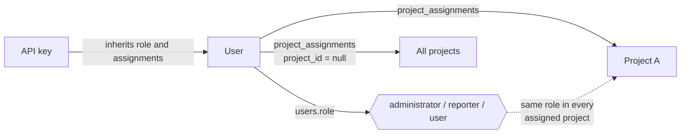
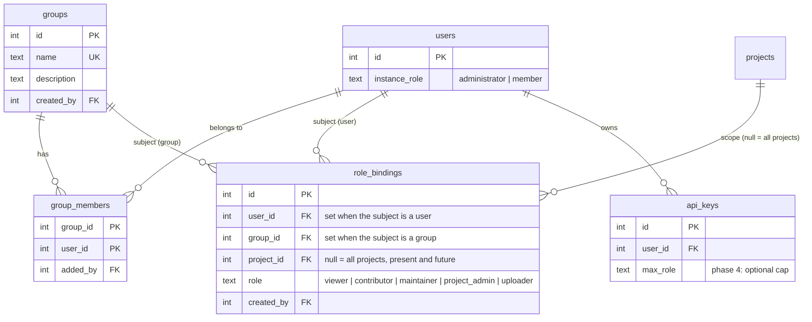
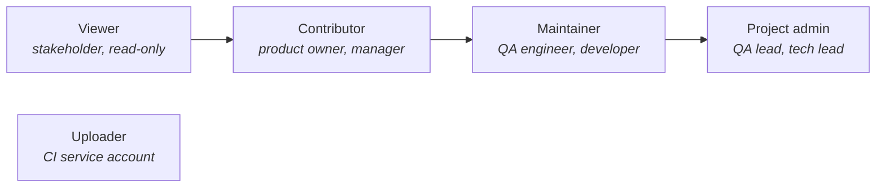
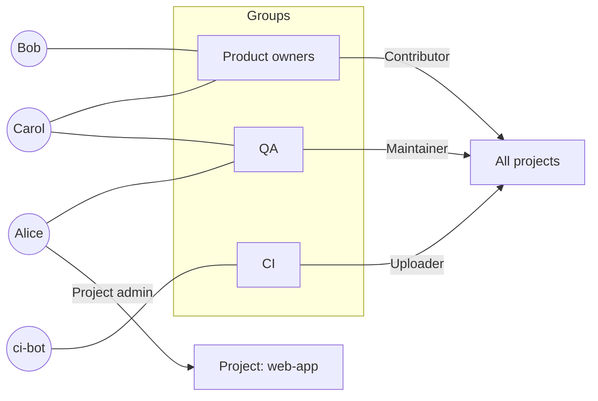
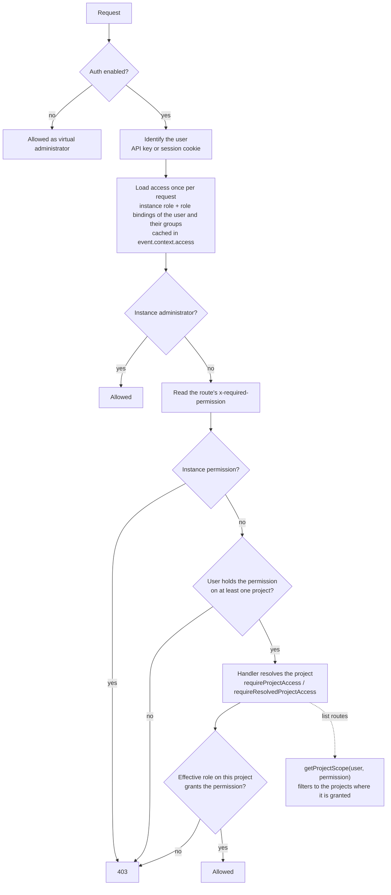
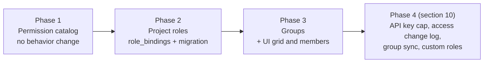
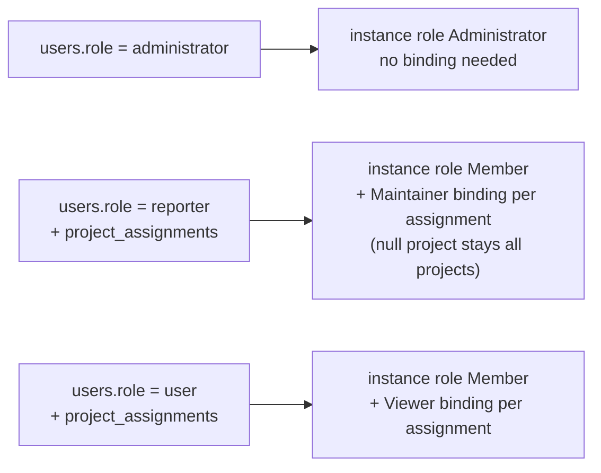
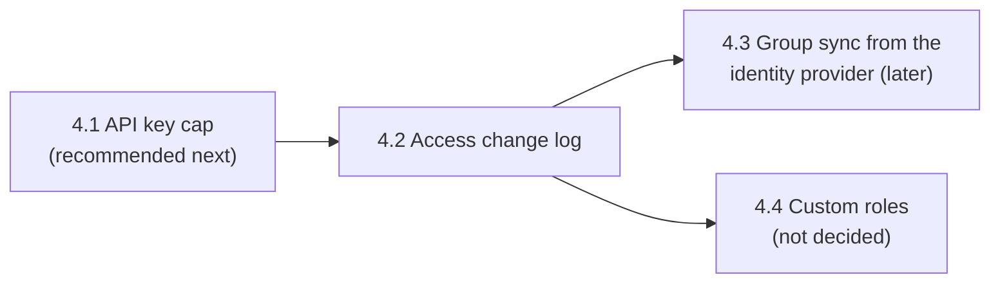

# Roles, groups and project-scoped permissions

**Status:** phases 1 to 3 implemented 2026-10-05 on branch `ccr-0d4e705a-33job2`; phase 4 (section 10: API key cap, access change log, identity provider group sync, custom roles) not started (decisions in section 9) · **Scope:** authorization on the server (route meta, `requireAuth`,
`requireProjectAccess`, project scope), the MCP write tools, the demo router, the dashboard UI (`useAuth`, Settings →
Users / Permissions, project Members) and the docs (`operate/authentication.md`, `operate/project-access.md`) ·
**Replaces:** the three global roles and the `project_assignments` table

**Goal:** a team can give each person exactly the rights their job needs, project by project, and manage them as
groups. A product owner can file a Jira issue without being able to triage, quarantine, upload or edit the project; a
QA lead can manage their own projects without being an instance administrator.

---

## 1. Vocabulary

One name per concept, used as is in code, UI copy and docs.

| Term | Meaning |
| --- | --- |
| **Permission** | One action on one kind of resource, named `resource:action` (`issue:create`, `run:submit`). The unit every route, MCP tool and UI control checks. Never shown to end users. |
| **Role** | A fixed, named set of permissions (`Viewer`, `Contributor`, ...). What an administrator assigns. |
| **Instance role** | The role a user holds on the whole instance: `Administrator` or `Member`. Stored on the user. |
| **Project role** | The role a user or a group holds inside projects: `Viewer`, `Contributor`, `Maintainer`, `Project admin`, `Uploader`. |
| **Group** | A named set of users (`QA`, `Product owners`, `CI`). Receives project roles like a user does. |
| **Role binding** | One row saying "this user or this group holds this project role on this project, or on all projects". Replaces a project assignment. |
| **Effective role** | The highest project role a user holds on one project, across their own role bindings and their groups' role bindings. |

---

## 2. What we have today



- **Three global roles** (`shared/types.ts` `Role`). Each route declares the roles it accepts in its
  `x-required-roles` OpenAPI meta, read by `requireAuth` (`server/utils/auth.ts`):

  | Roles accepted | Routes | What they cover |
  | --- | --- | --- |
  | administrator, reporter, user | 164 | reading anything in an assigned project |
  | administrator, reporter | 70 | uploading runs **and** triage **and** Jira issues, links, share links, report schedules, AI diagnosis, quarantine, markers, test functions, selections |
  | administrator | 68 | users, instance settings, Jira connections, project settings and members, deleting runs and projects, tags |
  | none (any signed-in user or public) | 32 | auth, channels, subscriptions, run lifecycle with a run token |

- **Project access** (`server/utils/project-access.ts`): a non-admin sees only the projects in `project_assignments`
  (one row per project, or one global row). The role is the same in every project the user can open.
- **API keys** carry the full rights of their owner. No narrowing.
- **Ownership** is checked ad hoc in a few places (a saved dashboard can be edited by its owner).

### Why it does not fit a real team

1. **`reporter` mixes two different actors.** It is the role of the CI machine that uploads results *and* the role of
   the human who triages. Giving a product owner the right to file a Jira issue means also letting them upload runs,
   quarantine tests, close clusters and spend AI tokens. That is the reported problem.
2. **The role is global, the access is per project.** Someone cannot be QA lead on project A and read-only on project
   B.
3. **No delegation.** Only an instance administrator can edit a project or its members, so every team change goes
   through them, and project owners end up as instance administrators (with access to AI keys, SMTP, users).
4. **No groups.** Access is granted user by user, project by project. A new hire means many clicks on the permission
   grid, and nobody can answer "what can the QA team do?".
5. **The role name `reporter` collides** with the Playwright reporter package (`@piwitests/reporter`), which makes docs
   and support answers ambiguous.

Note for today, before any of this ships: a `reporter` **already cannot edit projects** (`PATCH /api/projects/{id}` is
administrator only). Making the product owners reporters unblocks Jira issue creation now, at the cost of the extra
rights listed in point 1.

---

## 3. Choosing the authorization model

| Model | What it is | Fit for Piwi |
| --- | --- | --- |
| **Flat RBAC** (today) | A user holds one role for the whole system. | Too coarse: points 1 to 3 above. |
| **Scoped RBAC with groups** (recommended) | A user or a group holds a role *on a scope* (the instance, one project, all projects). The model of GitLab, GitHub repository roles, Grafana, Sentry and Kubernetes `RoleBinding`. | Matches Piwi's resource tree exactly: instance → project → everything else, since every entity already resolves to its project (`resolve*ProjectId`). Readable on a grid, explainable in one docs page. |
| **ABAC** (attribute-based, e.g. Cedar, OPA, Casbin policies) | Rules over attributes of the user, the resource and the request ("branch = main and env = prod"). | Powerful but the rules become a second language to maintain and test, cannot be shown as a grid, and no current need requires conditions. We keep **two or three attribute checks in code** (owner of a dashboard, author of a bug report, owner of an API key), as today. |
| **ReBAC** (relationship-based, Zanzibar: OpenFGA, SpiceDB) | Permissions derived from a graph of relations (user member of team, team viewer of folder, folder parent of document). | Built for deep, user-shared hierarchies. Piwi has two levels. It would add a service to deploy, which breaks the single-container image, the desktop app and SQLite. Not justified. A role binding row is already a (subject, relation, object) tuple, so a move to ReBAC later stays possible. |

**Decision:** scoped RBAC with groups, permissions checked in code, roles as fixed sets of permissions. Allow-only:
no "deny" rules, the effective role is the highest one granted. No nested groups.

---

## 4. Target model

### 4.1 Data model



- `role_bindings` has a check constraint "exactly one of `user_id`, `group_id`" and a unique index on
  (subject, `project_id`): one role per subject per scope.
- `users.role` keeps its column and only holds the instance role. `project_assignments` is dropped once its rows are
  migrated (section 7).
- Both schemas (`schema.sqlite.ts`, `schema.pg.ts`) and both migration sets get the change.

### 4.2 Roles

Two instance roles:

- **Administrator**: every permission on every project, plus the instance permissions (users, groups, settings, AI
  providers, Jira connections, storage, imports, tags, project creation and deletion). Unchanged from today.
- **Member**: can sign in, manage their profile, their API keys, their own dashboards, channels and subscriptions.
  Everything else comes from role bindings.

Project roles, each one includes the role before it, except `Uploader`:



### 4.3 Permission matrix

| Permission | Covers (today's routes) | Viewer | Contributor | Maintainer | Project admin | Uploader |
| --- | --- | :-: | :-: | :-: | :-: | :-: |
| `project:read` | every project read (the 164 routes) | ✓ | ✓ | ✓ | ✓ | ✓ |
| `issue:create` | `POST /integrations/issues`, issue draft, Jira projects / issue types / fields / assignable users, Piwi Picker `canCreate` | | ✓ | ✓ | ✓ | |
| `link:write` | entity links (create, edit, refresh, delete) | | ✓ | ✓ | ✓ | |
| `bug-report:write` | `PATCH /bug-reports/{id}` | | ✓ | ✓ | ✓ | |
| `report:write` | report snapshots, report schedules | | ✓ | ✓ | ✓ | |
| `share:create` | share links, sharing a dashboard with the instance | | | ✓ | ✓ | |
| `marker:write` | timeline markers | | ✓ | ✓ | ✓ | |
| `triage:write` | cluster status, assignee, snooze, base commit, bulk actions, merge suggestions, gap triage, flaky classification | | | ✓ | ✓ | |
| `quarantine:write` | quarantine, release, dismiss | | | ✓ | ✓ | |
| `ai:run` | diagnosis, agent diagnosis, step resolution, test-function extraction (spends AI tokens) | | | ✓ | ✓ | |
| `run:control` | rerun, bisect, fix attempts, flake lab, probes | | | ✓ | ✓ | |
| `test-assets:write` | selections, test functions, surface manifest, locator index rebuild | | | ✓ | ✓ | |
| `run:submit` | run setup, start, upload, submit, trace check, surface manifest, probe and flake lab results, AI step resolution during a run | | | ✓ | ✓ | ✓ |
| `project:manage` | project settings, capabilities, URL patterns, project ↔ Jira binding, the project's share links | | | | ✓ | |
| `project:members` | read and edit the project's role bindings (users and groups) | | | | ✓ | |
| `run:delete` | delete a run, release a kept run | | | | ✓ | |

`Maintainer` keeps `run:submit` because developers upload local runs with their own key. `Uploader` also reads the
project, because the reporter reads it during a run (project menu, locator and code indexes, selections, quarantine). Creating a project on first
submission still requires a binding on **all projects**, as today.

`share:create` stays at `Maintainer`: a share link opens data to people without an account, and a dashboard shared
with the instance is seen by everyone, so neither belongs to the role whose purpose is filing and following up issues.
Project deletion stays administrator only.

Instance permissions, held only by an administrator: `users:manage`, `groups:manage`, `settings:manage`,
`connections:manage`, `storage:manage`, `tags:manage`, `project:create`, `project:delete` (with its deletion preview).

A route that any signed-in user may call (their profile, API keys, dashboards, channels, subscriptions) declares
`signed-in` instead of a permission. The catalog and the matrix are code: `apps/application/shared/permissions.ts`.

### 4.4 Groups



Here Carol is `Maintainer` everywhere (highest of `Contributor` and `Maintainer`), Alice is `Project admin` on
`web-app` and `Maintainer` elsewhere.

### 4.5 How one request is authorized



The early check (H) keeps today's behavior of refusing with 403 before any database work; the project check (J) is
the real decision. `project:read` and `signed-in` pass the early check for every signed-in user: which projects a user
reads is decided by the project scope, so a member without any binding sees an empty dashboard, as today, not
errors.

---

## 5. Code changes

### 5.1 Shared permission catalog

`shared/permissions.ts`, pure and dependency-free, used by the server, the MCP tools, the demo router and the UI:

```ts
export const PROJECT_ROLES = ['viewer', 'contributor', 'maintainer', 'project_admin', 'uploader'] as const;
export type ProjectRole = (typeof PROJECT_ROLES)[number];
export type Permission = 'project:read' | 'issue:create' | /* ... */ 'run:delete';

export const ROLE_PERMISSIONS: Record<ProjectRole, readonly Permission[]> = { /* the matrix in section 4.3 */ };
export function roleGrants(role: ProjectRole, permission: Permission): boolean;
export function highestRole(roles: ProjectRole[]): ProjectRole | null; // Uploader is merged as a union, not ranked
```

### 5.2 Server

- **Route meta:** `'x-required-roles'` becomes `'x-required-permission'` (one permission, or an array meaning "any
  of"). `route-roles-match.ts` and `route-required-roles.ts` keep their structure and carry permissions. The OpenAPI
  page at `/docs` shows the permission and the roles that grant it.
- **`requireAuth`**: checks steps D to H of the diagram. `requireProjectAccess` and `requireResolvedProjectAccess` check
  step J with the route's permission. The `allowedRoles` override becomes an `allowedPermission` override.
- **`getProjectScope(db, user, permission = 'project:read')`**: same return type (`'all' | Set<number>`), so the list
  routes that already use it need no change beyond routes that list for a write permission.
- **Access loader:** one query, the user's bindings union their groups' bindings, computed once per request.
- **New routes:** `groups` CRUD and members (`instance` permission `groups:manage`), `role-bindings` read and write
  (administrator for any project, `project:members` for one project), `/api/auth/me` returns
  `access: { instanceRole, allProjects, projects: { [id]: role } }`.
- **Session revocation:** changing a user's instance role still bumps `sessionEpoch`. Project role and group changes
  need no revocation since access is loaded on every request.
- **Safety rules kept:** the last administrator cannot be demoted; a project admin cannot grant a role above their own
  and cannot edit bindings on other projects or on "all projects".
- **Route coverage check** (unit test, next to `app:check:demo`): every route declares a permission, and every route
  whose permission is a project permission calls one of the project access helpers.

### 5.3 MCP

`assertWriteRole(ctx)` in `server/utils/mcp/tools.ts` becomes `assertPermission(ctx, permission, projectId)`, using the
same matrix. The tool list hides write tools the caller can never use.

### 5.4 UI

- `useAuth` exposes `can(permission, projectId?)` built on `/api/auth/me` and `shared/permissions.ts`; `isAdmin`,
  `isReporter`, `canEdit` and the `hasRole([...])` calls are replaced.
- **Settings → Users:** the role column shows the instance role, a new column lists groups.
- **Settings → Groups** (new): list, create, rename, delete, add and remove members.
- **Settings → Permissions:** groups as rows above users; each cell is a role selector instead of a tick. A role a user
  only inherits (from a group or from "All projects") shows faint with a tooltip naming its source, as the locked
  "All projects" tick does today.
- **Project → Settings → Members:** visible to project admins; users and groups with their role on this project.
- `ProjectAccessGrid.vue` role labels, `ShareLinksModal.vue`, `ProjectSettingsPanel.vue`, `auth.global.ts` (`/edit`
  routes) move to `can(...)`.

### 5.5 Demo

The demo router mirrors the server logic by importing `shared/permissions.ts`. `DemoUserSwitcher` offers five personas:
Administrator, Project admin, Maintainer (QA), Contributor (product owner), Viewer.

### 5.6 Docs

`operate/authentication.md` (roles), `operate/project-access.md` (becomes "Access, roles and groups", with the matrix),
`operate/api-keys.md`, `operate/integrations.md` (who can file an issue), and the `x-required-permission` mention in
`apps/application/AGENTS.md`.

---

## 6. Phases



1. **Permission catalog, no behavior change.** Add `shared/permissions.ts`, switch every route to
   `x-required-permission`, map the three current roles onto the new matrix (`user` → Viewer, `reporter` →
   Maintainer). A unit test proves, route by route, that the set of roles accepted before equals the set granted after.
   Ships alone; it is the large mechanical step (334 route files) and the easy one to review.
2. **Project roles.** `role_bindings` table and the migration (section 7), access loader, `getProjectScope` by
   permission, `/api/auth/me` access, `can()` in the UI, MCP. After this phase the product owner problem is solved:
   bind them as `Contributor`.
3. **Groups.** `groups` and `group_members`, Settings → Groups, permission grid with role cells and group rows, project
   Members for project admins, demo personas, docs.
4. **Follow-ups**, each its own change and its own decision, detailed in section 10: cap an API key to a role and a
   project list, a log of access changes, group membership synced from the identity provider, and custom roles.

---

## 7. Migration of existing data



Nobody gains or loses a right during the migration: `Maintainer` is exactly what `reporter` could do, `Viewer`
exactly what `user` could do. OAuth sign-ups keep starting with no access (`Member`, no binding), as today. The REST
API keeps accepting `role: 'reporter' | 'user'` on `POST /api/users` for one release, translated to `member`; as
today, a new account has no access until it is granted some.

---

## 8. Risks

- **A route that checks only the early step.** A project permission checked without `requireProjectAccess` would
  allow a user granted it on project A to act on project B. The route coverage check in 5.2 guards against it.
- **Two copies of the logic** (server and demo router). Both import the same `shared/permissions.ts`; the demo
  runtime check (`app:check:demo:runtime`) gets a persona-based scenario.
- **Grid readability with role cells.** A select per cell is heavier than a tick; keyboard navigation of the current
  grid must keep working (arrow keys move, Space or Enter opens the selector).
- **External scripts using `role`.** Breaking change for `POST /api/users` and `PATCH /api/users/{id}` callers after
  the transition release; called out in the release notes.

---

## 9. Decisions

Decided on 2026-10-05:

1. **Five project roles**, named as in section 4.2: `Viewer`, `Contributor`, `Maintainer`, `Project admin`,
   `Uploader`.
2. **`Contributor`** (product owner) gets `issue:create`, `link:write`, `bug-report:write`, `report:write` and
   `marker:write`. **Not** `share:create`, which stays at `Maintainer`.
3. **`Project admin`** gets `run:delete` (delete and release runs) and the project ↔ Jira binding (in
   `project:manage`). The Jira connections themselves and project deletion stay administrator only.
4. **Groups are managed in Piwi only.** Identity provider sync stays a phase 4 option.

5. **The instance `Administrator` role is granted per user only.** A group carries project roles, never the
   instance role, so `groups` has no instance role column and becoming an administrator always shows on the user's
   own row.
6. **No service account kind.** CI runs as a regular user (`Member`) bound `Uploader`, through an API key. Phase 4's
   API key cap is the way to narrow a key further.

No question is open; the next step is phase 1.

---

## 10. Phase 4: follow-ups

Phases 1 to 3 cover the reported need. Phase 4 is four independent changes, in the recommended order. Each ships on
its own, with its own migration, docs and tests, and none changes what phases 1 to 3 grant.



### 10.1 API key cap

**Problem.** A key carries all of its owner's access. An administrator who creates a key for a CI pipeline hands the
pipeline every permission on the instance; a Maintainer's personal key used in a script can triage and spend AI
tokens. Today the only way to limit a key is a dedicated account.

**Design.**
- Two optional limits on a key, chosen when it is created and never widened afterwards (a new key is the way to get
  more): a **role cap** (`api_keys.role_cap`, a `ProjectRole`, null = no cap) and a **project list** (new
  `api_key_projects (api_key_id, project_id)`, no row = every project the owner can open).
- A key's access is the owner's access narrowed by both limits: on each project, the permissions the owner holds there
  that the capped role also grants; projects outside the list are dropped; a capped key never carries an instance
  permission, even when its owner is an administrator. Pure function in `shared/permissions.ts`:
  `capAccess(access, { role, projectIds })`, applied by `requireAuth` when the request comes with a key.
- The owner's later changes still apply: losing a role on a project removes it from the key too, since the key is
  computed from the owner at every request.
- UI: the API key form (Settings → Users → API keys, and the user's own keys) gets "Limit to role" and "Limit to
  projects". The key list shows the limits.
- Reporter, MCP and IDE clients need no change: they send the key as today.

**Done when.** A key capped to `Uploader` submits a run and gets 403 on a triage route even when its owner is an
administrator; a key limited to project A gets "No access to this project" on project B; the docs page on API keys
recommends a capped key for CI.

### 10.2 Access change log

**Problem.** Nothing records who granted or removed access. With groups and delegated project admins, "why can this
person do that, and since when" needs an answer.

**Design.**
- New table `access_events`: id, created_at, actor (user id, and API key id when the change came through a key),
  action (`binding.set`, `binding.removed`, `group.created`, `group.renamed`, `group.deleted`,
  `group.members.changed`, `user.created`, `user.deleted`, `user.instance_role.changed`, `api_key.created`,
  `api_key.revoked`), subject (user or group), project id (null for all projects or the instance), `before` and `after`
  as small JSON values.
- Written by the shared handlers (`role-bindings.ts`, `groups.ts`, `users.ts`, the API key routes) in the same
  transaction as the change, so the log cannot miss a change or record one that did not happen. The demo writes it too.
- Read with `GET /api/access-events` (filters: user, group, project, date range; `users:manage`), and for one project
  with `GET /api/projects/{id}/access-events` (`project:members`).
- UI: a History tab on Settings → Permissions, and a History link in a project's Members; Excel export (house rule).
- Retention: kept with no limit at first (a few rows per change); a retention setting can follow if volume shows it is
  needed.

**Done when.** Every change made from the grid, the members section, the groups page, the users page or the API
appears once, with its actor; a project admin sees the history of their project only.

### 10.3 Group membership from the identity provider (later)

Decided on 2026-10-05: groups are managed in Piwi for now. This section records the design so the tables leave room
for it.

- A group gets an optional external source: `groups.external_source` (`github-team`, later `oidc-claim`) and
  `groups.external_id` (`org/team-slug`, or the claim value).
- At each OAuth sign-in, the user's external groups are read (GitHub: `GET /user/teams`, with the `read:org` scope
  already requested when `PIWI_OAUTH_GITHUB_ALLOWED_ORGS` is set) and their membership of every synced group is set to
  match. Manual groups are untouched. A synced group's members cannot be edited in Piwi; its roles can.
- Membership changes only at sign-in, so a user removed from a team keeps the group until they sign in again or an
  administrator removes them; the docs must say so. An optional periodic sync with an org token can close that gap.
- Google Workspace groups need the Directory API and an administrator's consent, and a generic OIDC provider does not
  exist yet in Piwi: both are prerequisites, not part of this change.

### 10.4 Custom roles (not decided)

**Question.** Today the five project roles are fixed: what each one may do is the matrix of section 4.3, defined in
`shared/permissions.ts`. An administrator chooses *who* holds which role, not *what* a role allows. Should an
administrator be able to define what a role allows?

Two ways to do it:

| | Edit the five roles | Add custom roles next to them (recommended if needed) |
| --- | --- | --- |
| What it is | Settings → Roles lets an administrator tick or untick permissions on Viewer, Contributor... | Settings → Roles lets an administrator create a role (name, description, ticked permissions); the five built-in roles stay as they are |
| Docs, support, demo | "Contributor" means something different on each instance | The five roles mean the same everywhere; a custom role is visibly local |
| Upgrade | A new permission added in a release needs a default on every edited role | A new permission goes into the built-in roles; custom roles get it only if an administrator ticks it |
| Effort | Smaller | A `roles` table, role bindings referring to built-in or custom roles, the access loader reading definitions (cached), Settings → Roles, grid and members selectors listing custom roles |

Rules for either: only project permissions can be ticked (instance permissions stay with the Administrator); a role
in use cannot be deleted until its bindings are moved; a Project admin may grant a custom role on their projects.

Until this is decided, a team that needs a different set of rights combines roles: rights add up across a user's
roles, so a user who is Contributor on a project directly and Uploader through a group (or on all projects) holds
both sets there. One subject holds one role per scope, so the combination comes from two bindings.
